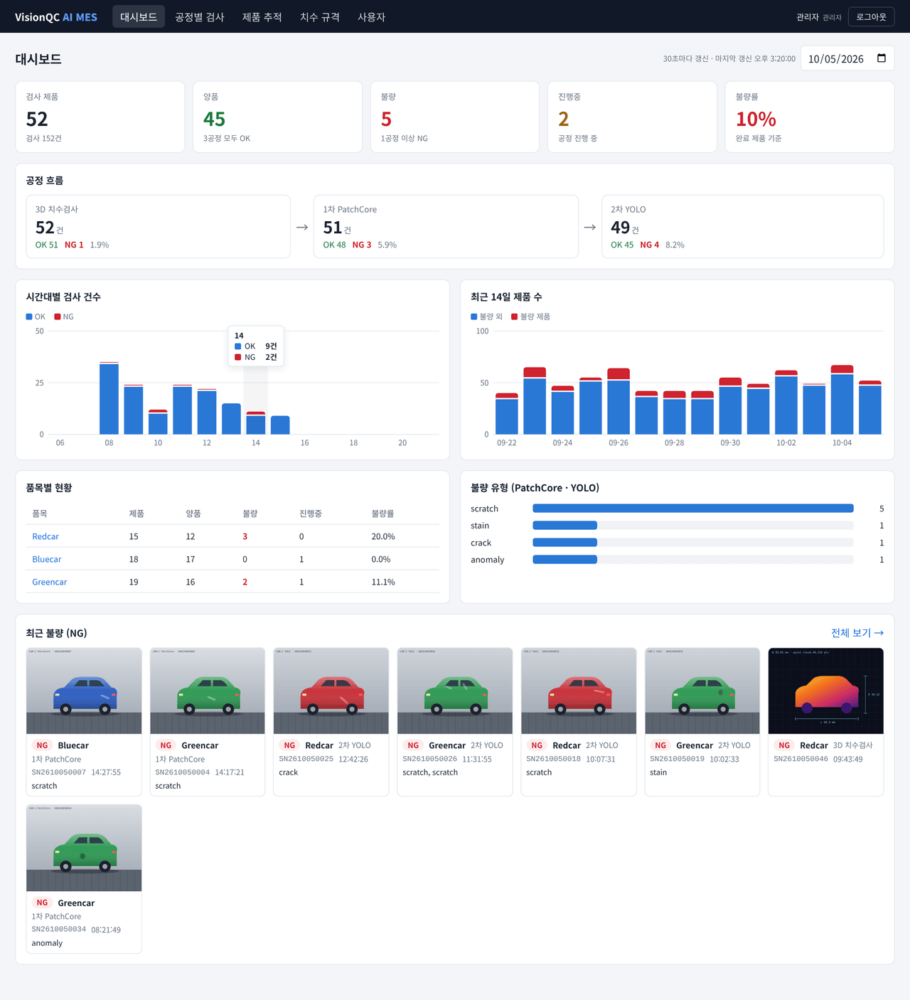
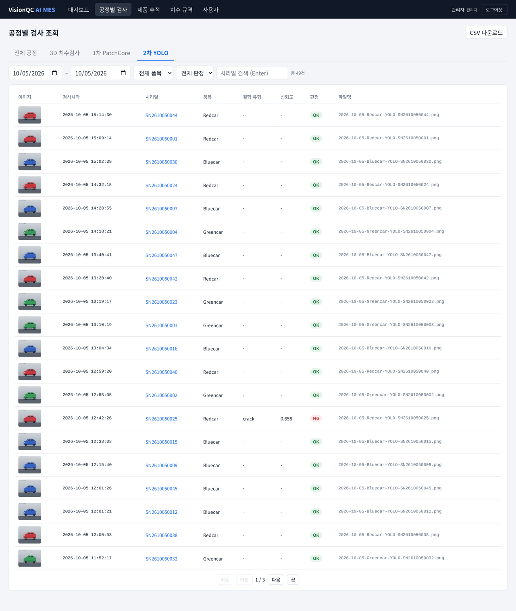
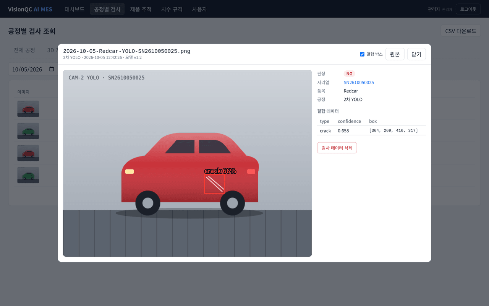
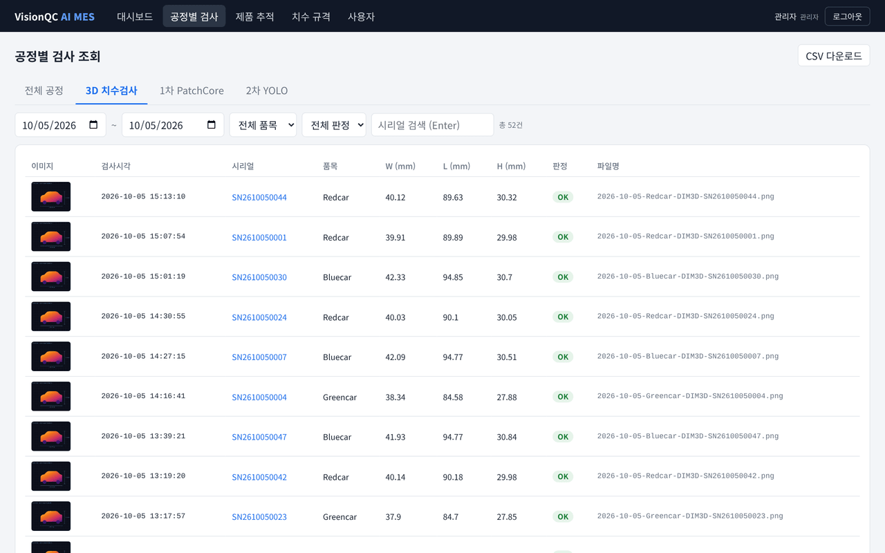
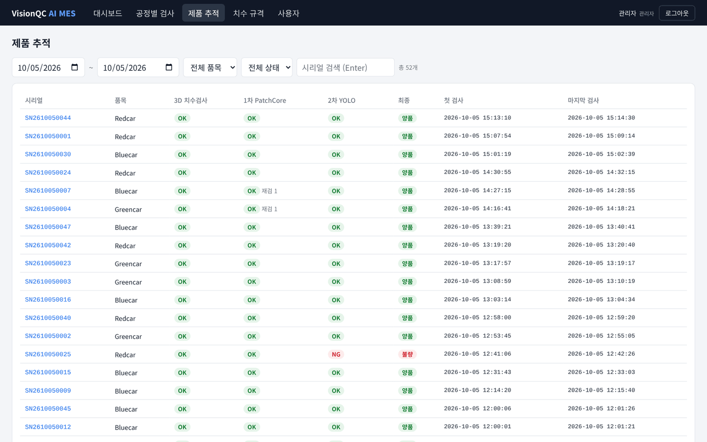
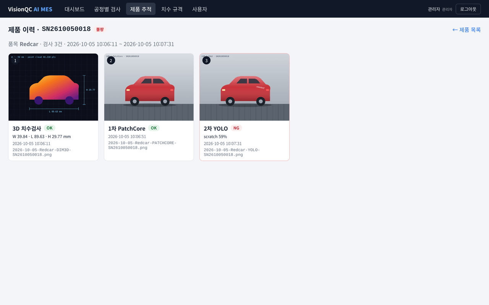
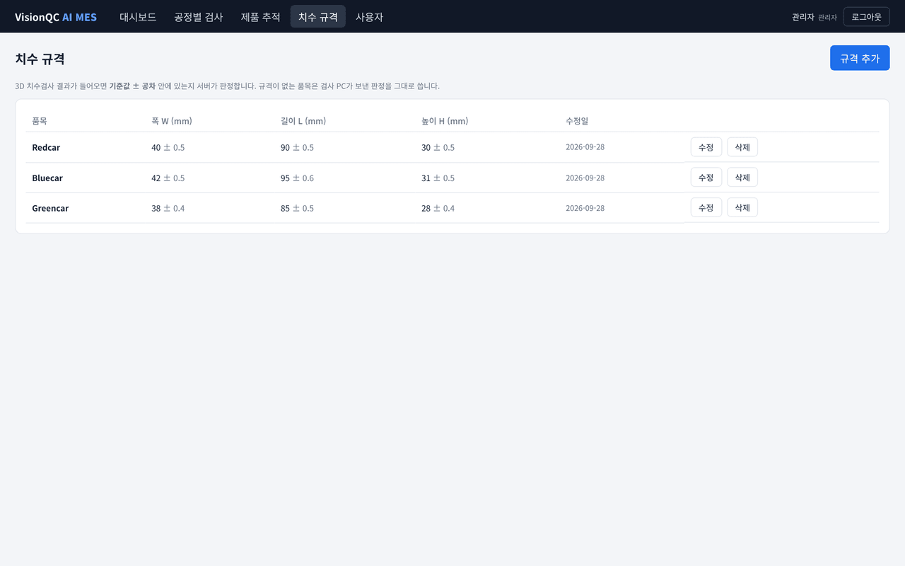
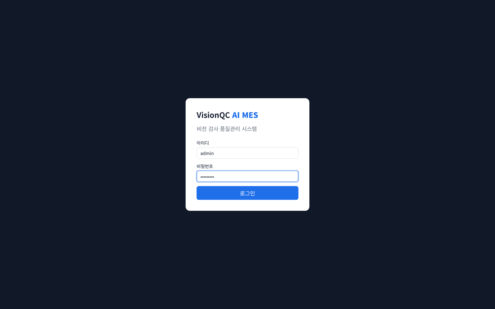

# VisionQC AI MES

비전 검사 라인(**3D 모델링 치수검사 → 1차 PatchCore → 2차 YOLO**)의 결과와 이미지를 모아서
**공정별로 조회**하고 **제품 단위로 추적**하는 MES.

| 구분 | 기술 |
|---|---|
| Frontend | React 18, react-router 6, Vite 5 |
| Backend | Python 3.11+, FastAPI, SQLAlchemy 2.0, Pydantic 2 |
| DB | MySQL 8 |
| 이미지 | 로컬 폴더 저장 + DB 에 파일명 기록 |
| 검사 PC 연동 | `vision_client/mes_client.py` (requests) |

## 목차
- [바로 시작](#바로-시작)
- [화면](#화면)
- [설치 · 실행](#설치--실행) — 준비물, install.bat / start.bat / test.bat, 패키지 목록 파일, 자주 나는 문제
- [핵심 규칙 요약](#핵심-규칙-요약)
- [폴더](#폴더)
- [문서](#문서)

## 바로 시작

```
① 준비물 설치: Python 3.11+ · Node.js 20+ · MySQL 8   (PC 당 한 번)
② install.bat 더블클릭                               (처음 한 번 + 패키지가 바뀌었을 때)
③ start.bat 더블클릭                                 (매일) → http://localhost:5173
```

- 로그인: `admin` / `admin1234` (관리자), `operator` / `oper1234` (작업자)
- API 문서: http://localhost:8000/docs
- 테스트: `test.bat` (기능별 테스트 파일은 [FEATURES.md 8장](docs/FEATURES.md#8-테스트-파일--기능-대응표))
- Docker 로 한 번에: `docker compose up -d --build` → http://localhost
- Mac/Linux: `bash install.sh` → `bash start.sh`

## 화면

> 아래 캡처는 더미 데이터(`seed.py --demo` 와 같은 방식)로 그린 화면입니다.

| 메뉴 | 내용 |
|---|---|
| 대시보드 | 검사 제품·양품·불량·진행중·불량률, 공정 흐름(공정별 OK/NG), 시간대별·최근 14일 차트, 품목별 표, 불량 유형 순위, 최근 불량 이미지. 오늘이면 30초마다 자동 갱신 |
| 공정별 검사 | 전체/3D/PatchCore/YOLO 탭, 기간·품목·판정·시리얼 필터, 이미지 보기(결함 박스), CSV 다운로드 |
| 제품 추적 | 시리얼별 3공정 결과와 최종 상태, 재검사 횟수 → 클릭하면 공정 순서대로 이미지 이력 |
| 치수 규격 | 품목별 기준값 ± 공차 (3D 치수 결과를 서버가 이 기준으로 판정) |
| 사용자 | 계정 추가, 권한 변경, 사용 중지, 비밀번호 초기화 (관리자) |

| 대시보드 | 공정별 검사 (YOLO) |
|---|---|
|  |  |
| **이미지 뷰어 (결함 박스)** | **공정별 검사 (3D 치수)** |
|  |  |
| **제품 추적** | **제품 이력** |
|  |  |
| **치수 규격** | **로그인** |
|  |  |

## 설치 · 실행

처음 받은 사람이 **설치부터 실행까지** 하는 방법입니다. 단계별로 손으로 하는 방법은 [docs/SETUP.md](docs/SETUP.md).

### 한눈에 보기

| 파일 | 언제 쓰나 | 하는 일 |
|---|---|---|
| `install.bat` | 처음 한 번, 팀원이 패키지를 추가했을 때 | 필요한 패키지를 전부 내려받아 설치 |
| `start.bat` | 매일 | 백엔드·프론트 서버를 켜고 브라우저를 엶 |
| `test.bat` | 코드 고친 뒤, PR 올리기 전 | 테스트 전체 실행 |
| `install.sh` `start.sh` `test.sh` | Mac/Linux 에서 | 위와 같음 (`bash install.sh`) |

---

### ① 준비물 설치 (PC 당 한 번)

`install.bat` 은 **패키지**를 설치해 주지만, 아래 프로그램 3개는 직접 설치해야 합니다.

| 프로그램 | 버전 | 받는 곳 | 설치할 때 주의 |
|---|---|---|---|
| Python | 3.11 이상 (3.12 권장) | https://www.python.org/downloads/ | 첫 화면에서 **"Add python.exe to PATH" 체크** |
| Node.js | 20 LTS 이상 | https://nodejs.org/ | 기본 설정 그대로 |
| MySQL Server | 8.0 / 8.4 | https://dev.mysql.com/downloads/installer/ | root 비밀번호를 정하고 **꼭 적어두기** |

설치가 끝나면 **열려 있던 cmd 창을 모두 닫고** 새 창에서 확인합니다.
```bat
python --version     :: Python 3.12.x 처럼 나오면 OK
node --version       :: v20.x 이상이면 OK
```

> 폴더 경로에 한글·공백이 없는 곳(예: `C:\work\VisionQC-MES`)에 프로젝트를 두는 걸 권장합니다.

---

### ② install.bat — 패키지 한 번에 설치

프로젝트 폴더에서 **`install.bat` 더블클릭** (또는 cmd 에서 `install.bat`, PowerShell 에서 `.\install.bat`).

#### 하는 일 (5단계)

| 단계 | 화면에 나오는 글 | 하는 일 |
|---|---|---|
| 1 | `[1/5] Checking Python and Node.js ...` | Python 3.11 이상, Node.js 가 있는지 확인 |
| 2 | `[2/5] Backend: creating virtual env backend\.venv ...` | `backend\.venv` 가상환경을 만들고 `backend\requirements-dev.txt` 의 패키지 설치 |
| 3 | `[3/5] Vision client: installing packages ...` | `vision_client\requirements.txt` 의 패키지를 같은 가상환경에 설치 |
| 4 | `[4/5] Frontend: npm install ...` | `frontend\package.json` 의 패키지 설치 (처음엔 몇 분 걸림) |
| 5 | `[5/5] Settings file backend\.env ...` | 설정 파일 `backend\.env` 가 없으면 `.env.example` 을 복사해서 만듦 (있으면 손대지 않음) |
| 선택 | `Create MySQL database/user and load demo data now? (y/n)` | `mysql` 명령이 있을 때만 물어봄. `y` → root 비밀번호 입력 → DB·계정 생성 + 더미 데이터 |

마지막에 이렇게 나오면 성공입니다.
```
============================================================
  Install finished.
  Start servers : start.bat
  Run tests     : test.bat
  Login         : admin / admin1234
============================================================
```

`Install FAILED.` 가 나오면 그 바로 위의 `[ERROR]` 줄이 원인입니다 → 아래 [문제 해결](#자주-나는-문제) 참고.

> 창의 안내 문구가 영어인 이유: cmd 에서 한글이 들어간 `.bat` 은 글자가 깨지면서 명령이 잘못 실행될 수 있어서입니다.

#### DB 질문에 `n` 을 했거나 질문이 안 나왔다면
`mysql` 명령이 PATH 에 없으면 DB 단계는 건너뜁니다. 이때는 직접 한 번만 해 주세요.
1. MySQL Workbench → `File > Open SQL Script` → `backend\sql\schema.sql` → 번개 아이콘(실행)
2. cmd 에서
   ```bat
   cd backend
   .venv\Scripts\python.exe seed.py --demo
   ```
   → 관리자 `admin/admin1234`, 작업자 `operator/oper1234`, 품목 규격 3개, 최근 7일 더미 검사 데이터가 생깁니다.

#### 다시 실행해도 되나요?
네. 이미 설치된 건 건너뛰고 **빠지거나 바뀐 것만** 설치합니다. `.env` 도 이미 있으면 그대로 둡니다.

---

### ③ start.bat — 매일 실행

**`start.bat` 더블클릭** → 검은 창 2개가 뜨고, 몇 초 뒤 브라우저가 열립니다.

| 창 제목 | 내용 | 주소 |
|---|---|---|
| `VisionQC backend :8000` | FastAPI 서버 | http://localhost:8000/docs (API 문서) |
| `VisionQC frontend :5173` | React 화면 | http://localhost:5173 (로그인 화면) |

- 끌 때: 두 창을 닫거나 각 창에서 `Ctrl + C`
- 코드를 저장하면 두 서버 모두 자동으로 다시 반영됩니다 (껐다 켤 필요 없음)
- MySQL 은 Windows 서비스로 자동 실행됩니다. 꺼져 있으면 `Win + R` → `services.msc` → `MySQL80` 시작

---

### test.bat — 테스트

```bat
test.bat                                 :: 백엔드 + 검사PC 클라이언트 전체
test.bat tests\test_ingest.py -v         :: 백엔드 테스트 파일 하나
test.bat tests\test_ingest.py::test_retest_gets_suffix -v   :: 테스트 하나
```
MySQL 없이 임시 DB 로 돌아가서, 서버를 켜지 않아도 됩니다. 마지막에 `ALL TESTS PASSED` 가 나오면 통과.
어떤 테스트 파일이 어떤 기능인지는 [docs/FEATURES.md 8장](docs/FEATURES.md#8-테스트-파일--기능-대응표).

---

### 의존성(패키지) 목록 파일

`install.bat` 은 아래 4개 파일을 읽어서 설치합니다. **패키지를 추가·변경할 때는 이 파일들만 고치면 됩니다.**

| 파일 | 어디에 쓰나 | 주요 패키지 |
|---|---|---|
| `backend/requirements.txt` | 백엔드 실행 | fastapi, uvicorn, sqlalchemy, pymysql, cryptography, pydantic, pydantic-settings, pyjwt, bcrypt, python-multipart, pillow |
| `backend/requirements-dev.txt` | 위 + 테스트 | (requirements.txt 전부) + pytest, httpx |
| `frontend/package.json` | 프론트엔드 | react, react-dom, react-router-dom, vite, @vitejs/plugin-react |
| `vision_client/requirements.txt` | 검사 PC 클라이언트 | requests, numpy(선택), pytest(테스트용) |

각 패키지가 무엇이고 왜 쓰는지는 [docs/PACKAGES.md](docs/PACKAGES.md).

#### 설치하면 생기는 것 (Git 에 올리나?)

| 생기는 것 | 위치 | Git |
|---|---|---|
| Python 가상환경 | `backend\.venv\` | ❌ 올리지 않음 (각자 PC 에서 install.bat 으로 생성) |
| npm 패키지 | `frontend\node_modules\` | ❌ 올리지 않음 |
| 설정 파일 | `backend\.env` | ❌ 올리지 않음 (비밀번호가 들어 있음) |
| npm 버전 고정 파일 | `frontend\package-lock.json` | ✅ **올림** — 4명이 같은 버전을 쓰게 됨 (처음 설치한 사람이 커밋) |
| 검사 이미지 | `backend\storage\` | ❌ 올리지 않음 |

`.gitignore` 에 이미 설정되어 있어서 실수로 올라가지 않습니다.

#### 팀원이 패키지를 추가했을 때

```
추가한 사람:  pip install 새패키지  →  requirements.txt 에 한 줄 추가  →  커밋/PR
              (프론트는 npm install 새패키지  →  package.json · package-lock.json 커밋)
나머지 팀원:  git pull  →  install.bat 다시 실행
```

#### 깨끗하게 다시 설치하고 싶을 때
설치가 꼬였을 때는 아래 두 폴더를 지우고 `install.bat` 을 다시 실행하면 됩니다.
```bat
rmdir /s /q backend\.venv
rmdir /s /q frontend\node_modules
install.bat
```
(`backend\.env` 와 DB 데이터는 그대로 남습니다)

---

### Mac / Linux

```bash
bash install.sh     # 설치
bash start.sh       # 실행 (Ctrl+C 로 둘 다 종료)
bash test.sh        # 테스트 (bash test.sh tests/test_ingest.py -v 처럼 일부만도 가능)
```
Python 명령 이름이 다르면 `PYTHON=python3.12 bash install.sh` 처럼 지정합니다.

---

### 검사 PC 에만 설치할 때

MES 서버가 아니라 AI 검사 프로그램이 돌아가는 PC 라면 `install.bat` 은 필요 없습니다.
`vision_client` 폴더의 `mes_client.py` 와 `requirements.txt` 만 복사해서
```bat
pip install -r requirements.txt
```
자세한 연동 방법은 [docs/SETUP.md 7장](docs/SETUP.md#7-검사-pc-연동).

---

### 자주 나는 문제

| 화면에 나온 글 | 원인 | 해결 |
|---|---|---|
| `[ERROR] "python" was not found.` | Python 미설치 또는 PATH 미등록 | Python 재설치하면서 **"Add python.exe to PATH" 체크** → cmd 새로 열기 |
| `[ERROR] Python 3.11 or newer is required.` 아래 버전이 안 나옴 | Windows 스토어용 가짜 `python` 이 잡힘 | 설정 → 앱 → 고급 앱 설정 → **앱 실행 별칭** 에서 `python.exe`, `python3.exe` 끄기 → Python 정식 설치 |
| `[ERROR] Python 3.11 or newer is required.` + 3.10 이하 버전 | 예전 Python | 3.12 설치 (여러 버전이 있으면 설치 화면에서 PATH 체크한 버전이 우선) |
| `[ERROR] "npm" was not found.` | Node.js 미설치 | Node.js LTS 설치 → cmd 새로 열기 |
| `Could not find a version that satisfies the requirement ...` / `SSL` / `ProxyError` | 인터넷 차단, 회사·학원 프록시 | 다른 네트워크(휴대폰 핫스팟 등)에서 실행, 또는 관리자에게 pypi.org · registry.npmjs.org 허용 요청 |
| `npm ERR! ... EACCES` / `EPERM` | 백신·다른 프로그램이 파일을 잡고 있음 | VS Code 등 닫고 다시 실행, 안 되면 `frontend\node_modules` 지우고 재시도 |
| `[WARN] DB creation failed.` | MySQL 꺼짐 / root 비밀번호 틀림 | `services.msc` 에서 `MySQL80` 시작, 비밀번호 확인 후 install.bat 다시 실행 |
| start.bat: `Dependencies are not installed. Run install.bat first.` | 설치 전 | install.bat 먼저 |
| start.bat 후 화면에 `요청 실패 (500)` | 백엔드 창에 오류 (대부분 DB 연결) | 백엔드 창의 빨간 글 확인 → MySQL 실행 여부, `backend\.env` 의 `DATABASE_URL` |
| 백엔드 창: `Unknown column ...` | 예전 버전으로 만든 DB 테이블 | `cd backend` → `.venv\Scripts\python.exe seed.py --reset --demo` (**데이터 삭제됨**) |
| 백엔드 창: `only one usage of each socket address` | 8000 포트를 이미 쓰는 중 (서버를 두 번 켬) | 기존 창 닫고 다시 start.bat |

여기에 없는 문제는 [docs/SETUP.md 11장](docs/SETUP.md#11-문제-해결), 그래도 안 되면 오류 메시지 전체를 팀 채팅에 올려 주세요.

## 핵심 규칙 요약

- **이미지 파일명**: `yyyy-mm-dd-품목-공정-시리얼.확장자` → `storage/images/yyyy-mm-dd/` 에 저장, DB 에 파일명·경로 기록. 재검사는 `_r2`
- **치수 데이터**: `width_mm`, `length_mm`, `height_mm`, `status`
- **결함 데이터**: `defect_detected`, `type`, `confidence`, `box [x1,y1,x2,y2]`
- **제품 상태**: 공정별 마지막 결과 중 NG 가 있으면 불량, 3공정 모두 OK 면 양품, 아니면 진행중

자세한 내용은 [ARCHITECTURE.md](docs/ARCHITECTURE.md).

## 폴더

```
VisionQC-MES/
├─ backend/        FastAPI 서버 (app/, tests/, sql/, seed.py)
├─ frontend/       React 화면 (src/pages, src/components, src/api)
├─ vision_client/  검사 PC 용 전송 모듈
├─ docs/           문서 (images/ 에 화면 캡처)
├─ install.bat · start.bat · test.bat   설치 · 실행 · 테스트 (Mac/Linux: .sh)
└─ docker-compose.yml
```

## 문서

| 문서 | 내용 |
|---|---|
| **[docs/SETUP.md](docs/SETUP.md)** | 설치·구동 방법 (Windows 기준 단계별), 검사 PC 연동, 다른 PC 접속, Docker, 문제 해결 |
| **[docs/PACKAGES.md](docs/PACKAGES.md)** | 사용하는 패키지 전체 목록 — 무엇이고, 어디서, 왜 쓰는지 |
| **[docs/ARCHITECTURE.md](docs/ARCHITECTURE.md)** | 폴더·파일 역할, DB 설계, 판정 규칙, REST API 명세, 보안, 기능 추가하는 법 |
| **[docs/FEATURES.md](docs/FEATURES.md)** | 기능별 개발 계획 — 기능 19개(F00~F18)의 담당·순서·파일·API·완료 기준 테스트, 일정표, 충돌 규칙 |
| **[docs/TEAM.md](docs/TEAM.md)** | 4인 역할 분담 요약, Git 규칙 |

코드 파일마다 맨 위에 그 파일이 하는 일이, 함수마다 설명이 한국어 주석으로 달려 있습니다.

기능별 개발 순서와 의존관계:


