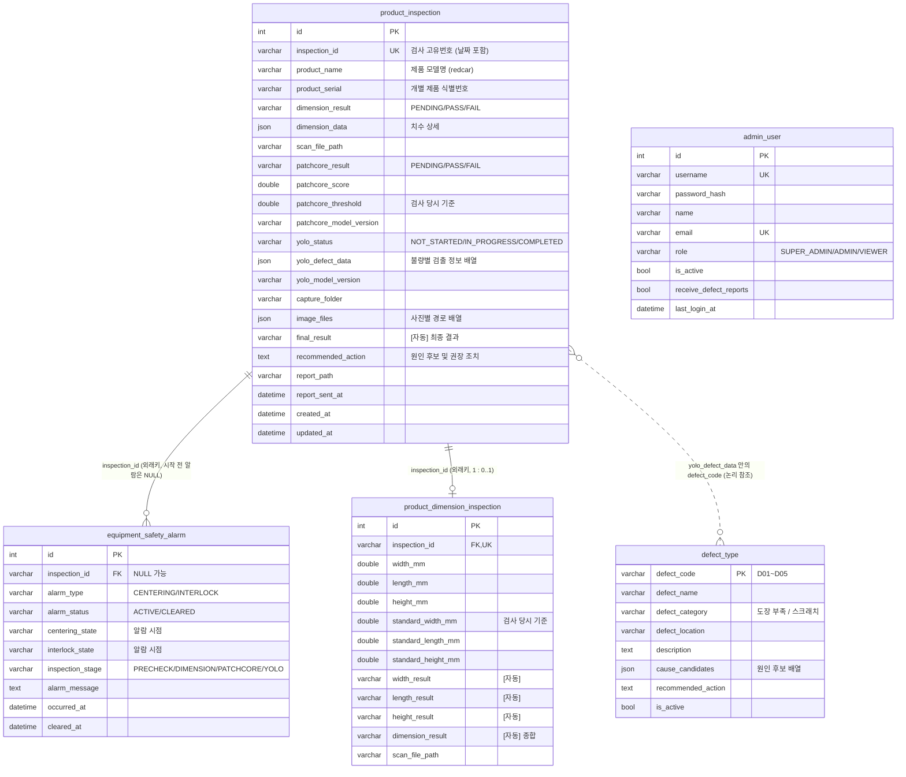

# 구조 · 설계 문서

코드를 처음 보는 팀원이 "어디서 무엇을 하는지" 찾을 수 있게 정리했습니다.
실행 방법은 [SETUP.md](SETUP.md), 패키지 설명은 [PACKAGES.md](PACKAGES.md).

- [1. 전체 흐름](#1-전체-흐름)
- [2. 폴더 · 파일 역할](#2-폴더--파일-역할)
- [3. 데이터 설계](#3-데이터-설계)
- [4. 판정 규칙](#4-판정-규칙)
- [5. REST API 명세](#5-rest-api-명세)
- [6. 인증 · 보안](#6-인증--보안)
- [7. 프론트엔드 구조](#7-프론트엔드-구조)
- [8. 기능 추가하는 법](#8-기능-추가하는-법)

---

## 1. 전체 흐름

```
 ┌──────────── 검사 라인 (검사 PC) ────────────┐
 │  제품 redcar  검사번호 20261006_inspection_143000_001
 │   ① 3D 스캔 → 치수 (가로/길이/높이)          │
 │   ② 치수 합격이면 PatchCore → 이상 점수       │
 │   ③ PatchCore 불합격이면 YOLO → 결함 사진     │
 └───────┬────────────────────────────────────┘
         │ db_client.py — DB 에 직접 저장 (사진은 MES 사진 폴더로 복사)
         │ (예전 방식: mes_client.py → 아래 HTTP API. 서버에 남아 있음)
         │ PUT  /api/inspections/{검사번호}              검사 시작
         │ PUT  /api/inspections/{검사번호}/dimension    치수
         │ PUT  /api/inspections/{검사번호}/patchcore    PatchCore
         │ POST /api/inspections/{검사번호}/yolo/captures  결함 사진 1장씩
         │ PUT  /api/inspections/{검사번호}/yolo/complete  YOLO 완료
         ▼
 ┌──────────── MES 서버 (FastAPI) ───────────┐
 │ 1. 형식 검증 (schemas.py)                   │
 │ 2. 사진 저장 (storage.py)                   │──▶ storage/images/2026-10-06/2026-10-06-redcar-143005-YOLO-..._c001.jpg
 │ 3. DB 기록 (models.py)                      │──▶ MySQL product_inspection / product_dimension_inspection
 │    합불·최종 결과는 DB 생성 컬럼이 자동 계산 │
 └───────┬───────────────────────────────────┘
         │ GET /api/dashboard/..., /api/inspections ...  (Bearer 토큰)
         ▼
 ┌──────────── 화면 (React) ───────────┐
 │ 대시보드 · 검사 조회 · 검사 상세     │
 │ 불량 코드 지정 → 원인 후보·권장 조치 │
 └─────────────────────────────────────┘
```

**검사 1회 = `product_inspection` 1행**이 이 시스템을 이해하는 핵심입니다.
같은 제품을 다시 검사하면 새 검사번호로 새 행이 생깁니다. 단계(치수 → PatchCore → YOLO) 결과는 같은 행을 채워 나갑니다.

---

## 2. 폴더 · 파일 역할

```
VisionQC-MES/
├─ backend/                         FastAPI 서버
│  ├─ app/
│  │  ├─ main.py                    앱 시작점. 라우터 등록, CORS, 테이블 자동 생성, /api/health
│  │  ├─ config.py                  .env 설정 읽기 (settings 객체). 제품별 기준 치수 PRODUCT_STANDARDS
│  │  ├─ database.py                DB 연결, 세션(get_db)
│  │  ├─ models.py                  테이블 5개 정의 + 자동 계산 SQL (EquipmentSafetyAlarm 추가, ProductInspection, ProductDimensionInspection, DefectType, AdminUser)
│  │  ├─ schemas.py                 API 요청/응답 형식 (Pydantic)
│  │  ├─ security.py                비밀번호 해시, JWT, 권한 체크(get_current_user, require_admin, require_super_admin, require_ingest_auth)
│  │  ├─ storage.py                 사진 저장, 파일명 규칙, 서명된 사진 주소
│  │  ├─ services/query.py          조회 필터, 날짜 범위, 응답 변환(to_summary/to_detail), 권장 조치 모으기
│  │  └─ routers/                   기능별 API (URL 별로 파일 분리)
│  │     ├─ auth.py                 /api/auth/*        로그인, 내 정보, 비밀번호 변경
│  │     ├─ users.py                /api/users/*       계정 관리 (최고관리자)
│  │     ├─ ingest.py               PUT/POST /api/inspections/{id}/...  단계별 결과 등록 (검사 PC → MES)
│  │     ├─ inspections.py          GET /api/inspections*  조회·CSV·상세, 불량 코드 지정, 삭제, /api/products
│  │     ├─ defect_types.py         /api/defect-types/*  불량 종류
│  │     ├─ dashboard.py            /api/dashboard/*   대시보드 집계
│  │     └─ images.py               /api/images/*      사진 파일 (서명 확인)
│  ├─ tests/                        pytest (SQLite 로 실행): test_auth · test_users · test_ingest · test_inspections · test_dashboard
│  ├─ sql/schema.sql                MySQL DB·계정·테이블 5개·불량 종류 초기 데이터
│  ├─ seed.py                       기본 계정·불량 종류·더미 데이터
│  ├─ requirements.txt / requirements-dev.txt
│  ├─ .env.example                  설정 예시 (복사해서 .env)
│  └─ Dockerfile
├─ frontend/                        React 화면
│  ├─ index.html · vite.config.js · package.json · nginx.conf · Dockerfile
│  └─ src/
│     ├─ main.jsx                   React 시작점
│     ├─ App.jsx                    주소 ↔ 화면 연결, 로그인/최고관리자 확인
│     ├─ styles.css                 전체 스타일
│     ├─ api/client.js              API 호출 모음 (토큰 자동 첨부, 401 처리), 상태 이름표
│     ├─ context/AuthContext.jsx    로그인 상태 공유 (useAuth)
│     ├─ components/
│     │  ├─ Layout.jsx              상단 메뉴 + 본문
│     │  ├─ ImageViewer.jsx         사진 크게 보기 (표시 사진 / 원본 + 결함 박스)
│     │  ├─ Charts.jsx              SVG 누적막대 / 가로막대
│     │  ├─ Pager.jsx               페이지 이동
│     │  └─ ResultBadge.jsx         최종 결과 · 단계 판정 · YOLO 상태 배지
│     └─ pages/
│        ├─ Login.jsx               /login
│        ├─ Dashboard.jsx           /
│        ├─ Inspections.jsx         /inspections
│        ├─ InspectionDetail.jsx    /inspections/:id
│        ├─ DefectTypes.jsx         /defect-types
│        ├─ Users.jsx               /users (최고관리자)
│        └─ Account.jsx             /account
├─ inspection/                      검사 PC 프로그램 (자세히: inspection/README.md)
│  ├─ common/                       공용
│  │  ├─ db_client.py               DB 직접 저장 모듈 (기본 방식, 재저장 큐)
│  │  ├─ test_db_client.py          임시 DB 에 저장 → MES API 로 읽어 보는 테스트
│  │  ├─ mes_client.py              MES API 로 보내는 예전 방식 (선택)
│  │  ├─ test_mes_client.py         가짜 서버로 도는 테스트
│  │  └─ example_pipeline.py        3단계 한 사이클 예시
│  ├─ station_3d/                   3D 스캔 치수 검사 코드 (3D 담당, 수정하지 않음)
│  ├─ bridge_3d/                    3D 측정 결과 → DB 저장 + handoff 기록 (save_3d_to_db.py)
│  ├─ station_vision/               3D 검사 + PatchCore → YOLO (한 가상환경)
│  │  ├─ inspection_app.py          버튼 화면: 턴테이블 + YOLO + MES 자동 전송 (--sim 시뮬레이션)
│  │  ├─ yolo_live.py               키보드 조작 검사 프로그램 (검사 영역, 촬영 로직)
│  │  ├─ turntable.py · turntable/turntable.ino   아두이노 턴테이블
│  │  └─ config.py · inspection_roi.json · best.pt · requirements.txt
│  └─ handoff/                      3D → 비전 검사번호 넘기는 폴더 (Git 제외)
├─ docs/                            문서
├─ install.bat / start.bat / test.bat   설치 · 실행 · 테스트 한 번에 (Mac/Linux 는 .sh)
└─ docker-compose.yml
```

---

## 3. 데이터 설계

### 3-1. 테이블 관계



(GitHub 에서 보면 그림으로 나옵니다. MySQL 정의는 `backend/sql/schema.sql`)

JSON 컬럼 원소
| 컬럼 | 원소 1개 |
|---|---|
| `yolo_defect_data` | `{ capture_number, defect_class, confidence, box: [x1,y1,x2,y2], angle_deg, defect_code }` (`defect_code` 는 사람이 지정, 처음엔 null) |
| `image_files` | `{ capture_number, original_path, annotated_path, metadata_path }` (STORAGE_DIR 기준 상대경로) |
| `dimension_data` | `{ tolerance_mm, width_mm…, standard_width_mm…, width_result… }` |

### 3-2. 설계 이유

| 결정 | 이유 |
|---|---|
| 검사 1회 = 한 행 | 한 제품의 검사 결과(치수 → PatchCore → YOLO)를 한 줄로 보고, 최종 결과를 행 안에서 바로 계산 |
| 합불·최종 결과를 DB 생성 컬럼으로 | 앱이 계산을 빼먹거나 규칙이 어긋날 수 없음. MySQL 에서 직접 넣어도 같은 결과 |
| 치수는 별도 테이블 + 기준값 함께 저장 | 기준이 바뀌어도 그 당시 기준으로 판정이 남음. 치수 테이블 결과는 서버가 전체 검사 행에 반영 |
| 결함·사진은 JSON 배열 | 한 검사에 사진·결함 수가 정해져 있지 않음. 사진 자체는 파일, DB 에는 경로만 |
| 불량 코드는 JSON 안 논리 참조 | YOLO 검출(scratch / white_paint)만으로는 D01~D05 가 정해지지 않아, 사람이 나중에 지정 |
| 원인은 '후보' | 이미지 검출 결과만으로 발생 원인을 확정하지 않음 |
| 계정은 삭제 대신 사용 중지 | 기록 보존 |

### 3-3. 사진 파일 규칙

```
storage/images/2026-10-06/2026-10-06-redcar-143005-YOLO-20261006_inspection_143000_001_c001.jpg
               └ 날짜폴더  └ 일자 - 제품 - HHMMSS(촬영시각) - 공정 - 검사번호_c사진번호 [_annotated] . 확장자
```
- 같은 사진 번호의 원본 · `_annotated`(표시 사진) · `.json`(검출 정보) 이 한 세트
- 날짜는 **촬영 시각** 기준 (서버에 들어온 시각이 아님)
- 검사번호 안의 `-` 는 `_` 로 바뀜 (구분자와 안 섞이게). DB 의 값은 원래 그대로
- 같은 이름이 이미 있으면 `_r2`, `_r3` (덮어쓰지 않음)
- 저장 순서: 파일 저장 → DB 기록. DB 기록이 실패하면 방금 저장한 파일을 지움

---

## 4. 판정 규칙

자동 계산 SQL 은 `backend/app/models.py` (= `sql/schema.sql`) 한 곳에만 있습니다.

| 대상 | 규칙 |
|---|---|
| 치수 축별 | 실측·기준 중 하나라도 없으면 `PENDING`, `|편차|` ≤ 정상 한계 `PASS`, ≤ 불량 한계 `RECHECK`(재검, 다시 스캔), 초과 `FAIL` (경계값은 좋은 쪽). 한계: 가로 ±1.5 / ±2.5, 길이(전폭) ±3.5 / ±5.5, 높이 ±1.5 / ±2.0mm (정상 한계 / 불량 한계) = `models.py` 의 `DIM_RECHECK_MM` / `DIM_TOLERANCE_MM`, 3D 코드 `station_3d/config.py` 와 같은 값 |
| 치수 종합 | 하나라도 `FAIL` → `FAIL`, (FAIL 없이) 누락 → `PENDING`, 하나라도 `RECHECK` → `RECHECK`, 셋 다 `PASS` → `PASS`. `RECHECK` 는 최종 결과에서 `DIMENSION_PENDING` |
| 기준 치수 | 검사 PC 가 보낸 값 > 서버 설정 `PRODUCT_STANDARDS[제품]` |
| PatchCore | 이상 점수 ≥ 기준 → `FAIL`, 아니면 `PASS` (서버 판정, 기준값을 같이 저장) |
| 최종 결과 | 치수 대기 → `DIMENSION_PENDING` / 치수 불합격 → `DIMENSION_DEFECT` / PatchCore 대기 → `PATCHCORE_PENDING` / PatchCore 합격 → `NORMAL` / PatchCore 불합격 + YOLO 완료 → `PROCESS_DEFECT` / 그 외 → `YOLO_PENDING` |
| 불량 · 대기 묶음 | 불량 = `DIMENSION_DEFECT` + `YOLO_PENDING` + `PROCESS_DEFECT`, 대기 = `DIMENSION_PENDING` + `PATCHCORE_PENDING` |
| 불량률 | 불량 ÷ (정상 + 불량) × 100. 대기는 제외 |
| 날짜 귀속 | 검사 시작 시각(`created_at`) 기준 |
| 장비 안전 | 검사 허용은 **센터링 OFF(정위치) AND 인터락 0(정상)** 일 때만. ON / 1 / UNKNOWN(미확인·센서 응답 끊김)이면 검사 프로그램이 시작하지 않거나 장비를 멈추고 검사를 보류하며, MES 에 알람을 남김. 알람 해제만으로 자동 재시작하지 않음. 검사 테이블 2개의 `centering_state`(OFF/ON/UNKNOWN), `interlock_state`(0/1/UNKNOWN)에 마지막 확인 값 기록. 이상이면 조건마다 알람 1행 (같은 검사·단계·상태의 발생 중 알람이 있으면 중복 안 만듦). 코드: `services/safety.py` |
| 권장 조치 | 결함에 지정된 불량 코드들의 `[코드 이름] 원인 후보: … / 권장 조치: …` 를 모아 `recommended_action` 에 저장 |

PatchCore 가 불합격이면 YOLO 가 불량 유형을 분류하지 못하더라도 정상으로 바꾸지 않습니다 (`YOLO_PENDING` / `PROCESS_DEFECT`).

---

## 5. REST API 명세

공통
- 기본 주소: `http://<서버>:8000` (전체 목록과 직접 시험: `/docs`)
- 인증: `Authorization: Bearer <토큰>` (검사 PC 등록 API 는 `X-API-Key` 도 가능)
- 날짜 파라미터: `YYYY-MM-DD`, 시각: ISO 8601 (`2026-10-06T14:30:05+09:00`)
- 에러 응답: `{"detail": "메시지"}` 또는 검증 오류 배열

| 코드 | 의미 |
|---|---|
| 200 / 201 / 204 | 성공 / 생성됨 / 성공(내용 없음) |
| 400 | 잘못된 요청 (확장자, 기간, 사용 중지된 불량 코드 등) |
| 401 | 로그인 필요 / 토큰 만료 / API Key 틀림 |
| 403 | 권한 없음 / 비활성 계정 / 사진 주소 서명 오류 |
| 404 | 없음 (검사 행이 없는데 product_name 없이 단계 결과를 보냄 포함) |
| 409 | 중복 (아이디, 이메일, 같은 사진 번호) |
| 413 | 사진 너무 큼 |
| 422 | 입력 형식 오류 |

### 5-1. 인증

| Method | URL | 내용 |
|---|---|---|
| POST | `/api/auth/login` | `{ username, password }` → `{ access_token, token_type }`. 성공 시 `last_login_at` 기록 |
| GET | `/api/auth/me` | `{ id, username, name, email, role, is_active, receive_defect_reports, last_login_at }` |
| PUT | `/api/auth/password` | `{ current_password, new_password }` → 204 |

### 5-2. 검사 등록 (검사 PC)

모두 `X-API-Key` 또는 로그인. 응답은 검사 상세(`InspectionDetailOut`, 아래 5-3).
단계 API 는 검사 행이 없으면 `?product_name=redcar` 쿼리가 있을 때 새로 만든다.

| Method | URL | 본문 |
|---|---|---|
| PUT | `/api/inspections/{inspection_id}` | `{ product_name, product_serial?, capture_folder?, started_at? }` |
| PUT | `/api/inspections/{inspection_id}/dimension` | `{ width_mm, length_mm, height_mm, standard_width_mm?, standard_length_mm?, standard_height_mm?, scan_file_path? }` (값은 null 가능 → 대기) |
| PUT | `/api/inspections/{inspection_id}/patchcore` | `{ score, threshold, model_version? }` |
| POST | `/api/inspections/{inspection_id}/yolo/captures` | multipart: `original`(사진), `annotated`(사진, 선택), `payload`(JSON 문자열: `{ capture_number, angle_deg?, captured_at?, model_version?, defects: [{ defect_class, confidence, box? }] }`) → 201 |
| PUT | `/api/inspections/{inspection_id}/yolo/complete` | `{ model_version? }` |

curl 로 시험해 보기:
```bat
curl -X PUT http://localhost:8000/api/inspections/20261006_test_001 -H "X-API-Key: change-this-ingest-key" -H "Content-Type: application/json" -d "{\"product_name\":\"redcar\"}"
curl -X PUT http://localhost:8000/api/inspections/20261006_test_001/dimension -H "X-API-Key: change-this-ingest-key" -H "Content-Type: application/json" -d "{\"width_mm\":41,\"length_mm\":90,\"height_mm\":31}"
```

### 5-3. 검사 조회

**GET /api/inspections**

| 파라미터 | 예 | 설명 |
|---|---|---|
| `final_result` | `PROCESS_DEFECT` / `DEFECT` / `PENDING` | 최종 결과 6가지, 또는 불량 전체·판정 전 전체 묶음 |
| `product_name` | `redcar` | 제품 모델 |
| `serial` | `0012` | 제품번호·검사번호 부분 검색 |
| `date_from`, `date_to` | `2026-10-01` | 기간 (종료일 포함). 둘 다 없으면 전체 기간 |
| `page`, `size` | `1`, `20` | 페이지 (size 최대 200) |

```json
{ "total": 37, "page": 1, "size": 20, "items": [ {
    "id": 245, "inspection_id": "20261006_inspection_143548_001", "product_name": "redcar",
    "product_serial": "RC-0001", "dimension_result": "PASS", "patchcore_result": "FAIL",
    "yolo_status": "COMPLETED", "final_result": "PROCESS_DEFECT",
    "defect_count": 2, "defect_classes": ["scratch"], "capture_count": 1,
    "thumbnail_url": "/api/images/2026-10-06/...annotated.jpg?exp=...&sig=...",
    "created_at": "2026-10-06T14:35:48" } ] }
```

**GET /api/inspections/{inspection_id}** — 상세: 위 + `dimension_data`, `dimension`(축별), PatchCore 점수·기준, `defects[]`(index, 사진 번호, 결함 종류, 신뢰도, box, 각도, 불량 코드·이름), `images[]`(경로 + 서명된 `original_url`/`annotated_url`), `recommended_action`, 리포트 정보

**PUT /api/inspections/{inspection_id}/defects/{index}** — 관리자. `{ defect_code: "D04" | null }` → 원인 후보·권장 조치 다시 모음

**GET /api/inspections/export** — 목록과 같은 필터, CSV (최대 10만 행, 엑셀 한글 OK)

**DELETE /api/inspections/{inspection_id}** — 관리자. DB 행(치수 포함) + 사진 파일 삭제 → 204

**GET /api/products** — 검사에 등장한 제품 모델명 `["redcar"]`

### 5-4. 불량 종류

| Method | URL | 권한 | 본문 |
|---|---|---|---|
| GET | `/api/defect-types` | 로그인 | - |
| PUT | `/api/defect-types/{code}` | 관리자 | `{ defect_name, defect_category, defect_location?, description?, cause_candidates: [], recommended_action?, is_active }` (없으면 생성) |

### 5-5. 대시보드

**GET /api/dashboard/summary?date=2026-10-06**
```json
{
  "date": "2026-10-06", "total": 33, "normal": 26, "defect": 6, "pending": 1, "defect_rate": 18.75,
  "by_final": { "DIMENSION_PENDING": 1, "DIMENSION_DEFECT": 3, "PATCHCORE_PENDING": 0, "NORMAL": 26, "YOLO_PENDING": 0, "PROCESS_DEFECT": 3 },
  "by_stage": [ { "stage": "DIMENSION", "counts": { "PASS": 29, "FAIL": 3, "PENDING": 1 } }, ... ],
  "by_product": [ { "product_name": "redcar", "total": 33, "normal": 26, "defect": 6, "pending": 1 } ],
  "defect_classes": [ { "label": "white_paint", "count": 11 }, ... ],
  "defect_codes": [ { "label": "D04", "count": 2 }, { "label": "미분류", "count": 13 } ],
  "recent_defects": [ 검사 목록 한 줄, ... ]
}
```
**GET /api/dashboard/hourly?date=** → `[{ "label": "00", "total": 0, "defect": 0 }, ... 24개]`

**GET /api/dashboard/daily?date_from=&date_to=** → `[{ "label": "2026-09-23", "total": 30, "defect": 3 }, ...]` (기본 14일)

### 5-6. 장비 안전 (센터링 · 인터락)

| Method | URL | 권한 | 내용 |
|---|---|---|---|
| POST | `/api/safety/check` | 검사 PC(API Key) 또는 로그인 | `{ inspection_id?, product_name?, stage, centering_state, interlock_state, message? }` → `{ allowed, alarms[] }`. 이상이면 알람 기록 |
| GET | `/api/safety/alarms` | 로그인 | `status`(ACTIVE/CLEARED), `alarm_type`, `inspection_id`, `date_from`, `date_to`, `page`, `size` |
| POST | `/api/safety/alarms/{id}/clear` | 관리자 이상 또는 검사 PC | 해제 확인 기록 (검사를 다시 시작하지는 않음) |

`PUT /api/inspections/{id}/dimension` 에 `centering_state`, `interlock_state` 를 같이 보내면 치수 행에도 기록되고, 이상이면 알람이 남는다.

### 5-7. 계정 (최고관리자)

| Method | URL | 본문 |
|---|---|---|
| GET | `/api/users` | - |
| POST | `/api/users` | `{ username, password, name, email?, role, receive_defect_reports }` |
| PATCH | `/api/users/{id}` | `{ name?, email?, role?, is_active?, receive_defect_reports?, password? }` (보낸 것만 변경, 이메일 빈 문자열 = 삭제) |

### 5-8. 기타
- **GET /api/images/{경로}?exp=&sig=** — 사진 파일. 주소는 조회 API 응답의 `*_url` 을 그대로 사용
- **GET /api/health** — `{ "status": "ok", "db": "ok" }`

---

## 6. 인증 · 보안

| 항목 | 방식 | 코드 |
|---|---|---|
| 비밀번호 저장 | bcrypt 해시 (원문 저장 안 함) | `security.py` |
| 로그인 유지 | JWT (기본 8시간). 브라우저 localStorage 에 보관 | `security.py`, `api/client.js` |
| 권한 | `SUPER_ADMIN`: 계정 관리 + 아래 전부 / `ADMIN`: 불량 코드 지정, 불량 종류 수정, 검사 삭제 / `VIEWER`: 조회 | `require_super_admin`, `require_admin` |
| 검사 PC 업로드 | `X-API-Key` 헤더 (로그인 불필요). 타이밍 공격에 안전한 비교 | `require_ingest_auth` |
| 사진 접근 | HMAC 서명 + 만료시각이 붙은 주소만 허용. `../` 경로 조작 차단 | `storage.py`, `routers/images.py` |
| 입력 검증 | 제품 모델명·검사번호 형식 제한 (파일명 안전), 확장자·크기 제한 | `schemas.py`, `storage.py` |
| 계정 중지 | 삭제 대신 `is_active=false`. 토큰이 있어도 다음 요청부터 차단 | `get_current_user` |

운영 전에 꼭 바꿀 것: `.env` 의 `JWT_SECRET`, `INGEST_API_KEY`, `schema.sql`·`docker-compose.yml` 의 DB 비밀번호, 기본 계정 비밀번호.

---

## 7. 프론트엔드 구조

```
main.jsx
 └ BrowserRouter
    └ AuthProvider (로그인 상태)
       └ App (주소 → 화면)
          ├ /login → Login
          └ RequireAuth → Layout (메뉴)
                ├ /                  Dashboard
                ├ /inspections       Inspections
                ├ /inspections/:id   InspectionDetail ── ImageViewer (모달)
                ├ /defect-types      DefectTypes
                ├ /users             Users (최고관리자)
                └ /account           Account
```

| 규칙 | 설명 |
|---|---|
| API 호출은 `api/client.js` 로만 | 토큰 첨부, 401 처리, 에러 메시지 통일 |
| 조회 화면의 필터는 주소창에 | `/inspections?final_result=DEFECT&date_from=...` → 새로고침·링크 공유·대시보드에서 바로 이동 가능 |
| 서버(DB)가 판정, 화면은 표시만 | 합불·최종 결과 계산 로직을 화면에 두지 않음 |
| 개발 중 `/api` 는 Vite 프록시 | 프론트 코드에 서버 주소가 없음 |

---

## 8. 기능 추가하는 법

### 새 API 추가
1. 응답 형식을 `schemas.py` 에 추가 (필요하면)
2. 맞는 `routers/*.py` 에 함수 추가, 권한은 `Depends(get_current_user)` / `require_admin`
3. `tests/test_*.py` 에 테스트 추가 → `pytest -q`
4. `frontend/src/api/client.js` 의 `api` 에 호출 함수 추가 → 화면에서 `api.xxx()` 호출

### 새 제품 모델 추가
코드 수정 없음. 검사 PC 가 새 `product_name` 으로 보내면 자동으로 제품 목록에 나타납니다.
서버에서 기준 치수를 쓰려면 `.env` 의 `PRODUCT_STANDARDS` 에 `"제품명": [가로, 길이, 높이]` 추가.

### 불량 종류 추가
[불량 종류] 화면에서 관리자가 추가 (예: D06). 코드 수정 없음.

### 치수 판정 한계 변경
`models.py` 의 `DIM_TOLERANCE_MM` / `DIM_RECHECK_MM`, `sql/schema.sql` 의 숫자(`2.500001` 등), 3D 코드 `station_3d/config.py` 의 `TOLERANCE_MM` / `RECHECK_MM` 을 같이 바꾸고, 생성 컬럼이라 기존 DB 는 `ALTER TABLE ... MODIFY ...` 로 식을 다시 정의 (개발 중이면 `seed.py --reset`).

### DB 컬럼 추가
1. `models.py` 에 컬럼 추가
2. `schemas.py` 의 In/Out 에 필드 추가
3. 기존 DB 에 반영: 개발 중 `python seed.py --reset --demo`, 데이터가 있으면 `ALTER TABLE ... ADD COLUMN ...`
4. `sql/schema.sql` 도 같이 수정
