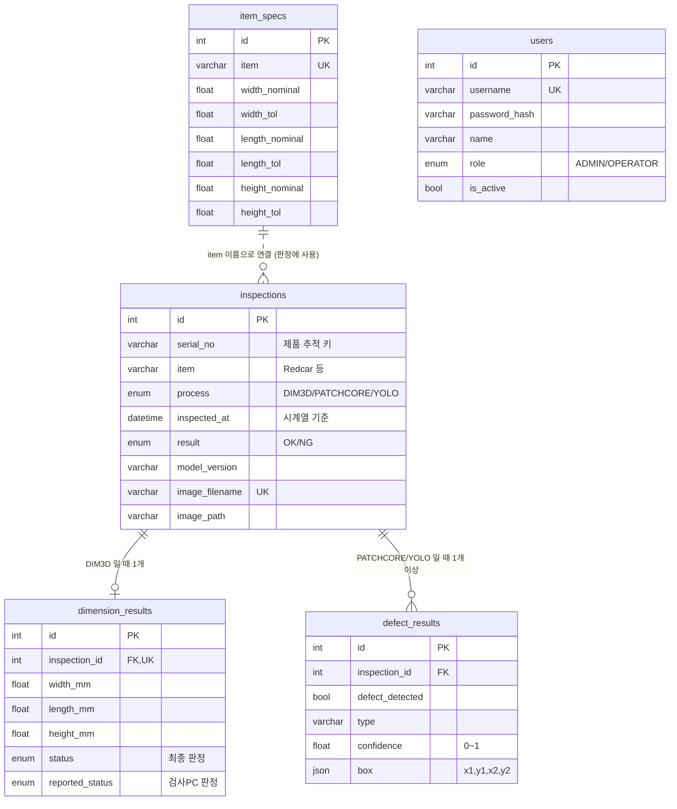

# 구조 · 설계 문서

코드를 처음 보는 팀원이 "어디서 무엇을 하는지" 찾을 수 있게 정리했습니다.
실행 방법은 [SETUP.md](SETUP.md), 패키지 설명은 [PACKAGES.md](PACKAGES.md).

- [1. 전체 흐름](#1-전체-흐름)
- [2. 폴더 · 파일 역할](#2-폴더--파일-역할)
- [3. 데이터 설계](#3-데이터-설계)
- [4. 판정 규칙](#4-판정-규칙)
- [5. REST API 명세](#5-rest-api-명세)
- [6. 인증 · 보안](#6-인증--보안)
- [7. 프론트엔드 구조](#7-프론트엔드-구조)
- [8. 기능 추가하는 법](#8-기능-추가하는-법)

---

## 1. 전체 흐름

```
 ┌──────────── 검사 라인 ────────────┐
 │  제품 SN0001 (Redcar)              │
 │   ① 3D 스캔 → 치수(W/L/H)          │
 │   ② PatchCore → 이상 점수/영역     │
 │   ③ YOLO → 결함 박스               │
 └───────┬───────────────────────────┘
         │ mes_client.py
         │ POST /api/inspections  (이미지 + JSON, X-API-Key)
         ▼
 ┌──────────── MES 서버 (FastAPI) ───────────┐
 │ 1. payload 형식 검증 (schemas.py)          │
 │ 2. 판정 (services/judge.py, 규격 사용)      │
 │ 3. 이미지 저장 (storage.py)                 │──▶ storage/images/2026-10-05/2026-10-05-Redcar-DIM3D-SN0001.png
 │ 4. DB 기록 (models.py)                      │──▶ MySQL inspections / dimension_results / defect_results
 └───────┬───────────────────────────────────┘
         │ GET /api/dashboard/..., /api/inspections, /api/products ...  (Bearer 토큰)
         ▼
 ┌──────────── 화면 (React) ───────────┐
 │ 대시보드 · 공정별 조회 · 제품 추적   │
 │ 이미지 + 결함 박스 표시              │
 └─────────────────────────────────────┘
```

**"검사"와 "제품" 두 단위가 있다는 것**이 이 시스템을 이해하는 핵심입니다.

| 단위 | 뜻 | 저장 | 예 |
|---|---|---|---|
| 검사 (inspection) | 공정 1번 통과 = 이미지 1장 | `inspections` 테이블 1행 | SN0001 의 YOLO 검사 |
| 제품 (product) | 같은 시리얼의 검사들을 묶은 것 | 저장 안 함, 조회할 때 계산 | SN0001 = 3D OK + PC OK + YOLO NG → 불량 |

---

## 2. 폴더 · 파일 역할

```
VisionQC-MES/
├─ backend/                         FastAPI 서버
│  ├─ app/
│  │  ├─ main.py                    앱 시작점. 라우터 등록, CORS, 테이블 자동 생성, /api/health
│  │  ├─ config.py                  .env 설정 읽기 (settings 객체)
│  │  ├─ database.py                DB 연결, 세션(get_db)
│  │  ├─ models.py                  테이블 정의 (User, ItemSpec, Inspection, DimensionResult, DefectResult)
│  │  ├─ schemas.py                 API 요청/응답 형식 (Pydantic)
│  │  ├─ security.py                비밀번호 해시, JWT, 권한 체크(get_current_user, require_admin, require_ingest_auth)
│  │  ├─ storage.py                 이미지 저장, 파일명 규칙, 서명된 이미지 주소
│  │  ├─ services/                  여러 API 가 같이 쓰는 로직
│  │  │  ├─ judge.py                OK/NG 판정 규칙 (유일한 판정 위치)
│  │  │  ├─ products.py             시리얼별 제품 상태 집계
│  │  │  └─ query.py                조회 필터, 날짜 범위, 응답 변환(to_out)
│  │  └─ routers/                   기능별 API (URL 별로 파일 분리)
│  │     ├─ auth.py                 /api/auth/*        로그인, 내 정보, 비밀번호 변경
│  │     ├─ users.py                /api/users/*       사용자 관리 (관리자)
│  │     ├─ specs.py                /api/specs/*       치수 규격
│  │     ├─ ingest.py               POST /api/inspections  검사 결과 등록 (검사 PC → MES)
│  │     ├─ inspections.py          GET  /api/inspections*  검사 조회·CSV·상세·삭제, /api/items
│  │     ├─ products.py             /api/products/*    제품 목록, 제품 이력
│  │     ├─ dashboard.py            /api/dashboard/*   대시보드 집계
│  │     └─ images.py               /api/images/*      이미지 파일 (서명 확인)
│  ├─ tests/                        pytest (SQLite 로 실행). 기능별 파일: test_auth · test_users · test_ingest
│  │                                · test_specs · test_products · test_dashboard · test_inspections, 공용 helpers.py
│  ├─ sql/schema.sql                MySQL DB·계정·테이블
│  ├─ seed.py                       기본 계정·규격·더미 데이터
│  ├─ requirements.txt / requirements-dev.txt
│  ├─ .env.example                  설정 예시 (복사해서 .env)
│  └─ Dockerfile
├─ frontend/                        React 화면
│  ├─ index.html                    HTML 껍데기 (#root)
│  ├─ vite.config.js                개발 서버, /api 프록시
│  ├─ package.json
│  ├─ nginx.conf, Dockerfile        Docker 배포용
│  └─ src/
│     ├─ main.jsx                   React 시작점
│     ├─ App.jsx                    주소 ↔ 화면 연결, 로그인/관리자 확인
│     ├─ styles.css                 전체 스타일
│     ├─ api/client.js              API 호출 모음 (토큰 자동 첨부, 401 처리)
│     ├─ context/AuthContext.jsx    로그인 상태 공유 (useAuth)
│     ├─ components/                여러 화면이 같이 쓰는 부품
│     │  ├─ Layout.jsx              상단 메뉴 + 본문
│     │  ├─ ImageViewer.jsx         이미지 + 결함 박스 + 상세 모달
│     │  ├─ Charts.jsx              SVG 누적막대 / 가로막대
│     │  ├─ Pager.jsx               페이지 이동
│     │  └─ ResultBadge.jsx         OK/NG/진행중 배지
│     └─ pages/                     화면 1개 = 파일 1개
│        ├─ Login.jsx               /login
│        ├─ Dashboard.jsx           /
│        ├─ Inspections.jsx         /inspections
│        ├─ Products.jsx            /products
│        ├─ ProductHistory.jsx      /products/:serial
│        ├─ Specs.jsx               /specs
│        ├─ Users.jsx               /users (관리자)
│        └─ Account.jsx             /account
├─ vision_client/                   검사 PC 용
│  ├─ mes_client.py                 전송 모듈 (재전송 큐, 모델 결과 변환)
│  ├─ requirements.txt              검사 PC 에 설치할 패키지
│  ├─ test_mes_client.py            가짜 서버로 도는 테스트
│  └─ example_pipeline.py           3공정 한 사이클 예시
├─ docs/                            문서
├─ install.bat / start.bat / test.bat   설치 · 실행 · 테스트 한 번에 (Mac/Linux 는 .sh)
├─ .gitattributes                   .bat=CRLF, .sh=LF 줄바꿈 고정
└─ docker-compose.yml
```

---

## 3. 데이터 설계

### 3-1. 테이블 관계



(GitHub 에서 보면 그림으로 나옵니다)

### 3-2. 설계 이유

| 결정 | 이유 |
|---|---|
| 검사 1건 = 이미지 1장 = `inspections` 1행 | 요구사항의 "이미지 파일명을 DB 에 기록해서 추적" 을 그대로 반영. 재검사도 행이 하나 더 생겨 이력이 남음 |
| 치수와 결함을 별도 테이블로 | 공정마다 데이터 모양이 다름. 한 테이블에 다 넣으면 빈 컬럼이 많아짐 |
| 결함은 1:N | YOLO 는 이미지 한 장에 박스 여러 개를 낼 수 있음 |
| `box` 는 JSON | 항상 4개 숫자 묶음이라 컬럼 4개로 쪼갤 필요가 없음 |
| `inspected_at` 에 인덱스 | 거의 모든 조회가 "기간" 조건. 공정·품목·판정과 묶은 복합 인덱스도 둠 |
| 제품 테이블이 없음 | 제품 상태는 검사 결과에서 항상 계산 가능 → 중복 저장하면 어긋날 위험 |
| `reported_status` 따로 저장 | 검사 PC 판정과 서버(규격) 판정이 다를 때 원인 분석용 |

### 3-3. 이미지 파일 규칙

```
storage/images/2026-10-05/2026-10-05-Redcar-DIM3D-SN0001.png
               └ 날짜폴더  └ yyyy-mm-dd - 품목 - 공정 - 시리얼 . 확장자
```
- 날짜는 **검사 시각** 기준 (서버에 들어온 시각이 아님)
- 시리얼 안의 `-` 는 `_` 로 바뀜 (구분자와 안 섞이게). DB 의 `serial_no` 는 원래 값
- 재검사: `..._r2.png`, `..._r3.png` (덮어쓰지 않음)
- 저장 순서: 판정 → 파일 저장 → DB 기록. DB 기록이 실패하면 방금 저장한 파일을 지움

---

## 4. 판정 규칙

모든 판정은 `backend/app/services/judge.py` 와 `services/products.py` 에만 있습니다.

| 대상 | 규칙 |
|---|---|
| DIM3D 검사 | 품목 규격이 있으면 세 축 모두 `|측정값 − 기준값| ≤ 공차` 이면 OK. 규격이 없으면 검사 PC 가 보낸 `status` 사용 (없으면 422) |
| PATCHCORE / YOLO 검사 | `defect_detected=true` 가 하나라도 있으면 NG |
| 제품 상태 | 공정별 **마지막** 검사 기준. 하나라도 NG → **불량**, 3공정 모두 OK → **양품**, 그 외 → **진행중** |
| 불량률 | 불량 ÷ (양품 + 불량) × 100. 진행중은 제외 |
| 날짜 귀속 | 제품은 **첫 검사한 날** 에 집계 (자정을 넘겨도 이틀에 걸쳐 세지 않음) |

---

## 5. REST API 명세

공통
- 기본 주소: `http://<서버>:8000`
- 인증: `Authorization: Bearer <토큰>` (업로드는 `X-API-Key` 도 가능)
- 날짜 파라미터: `YYYY-MM-DD`, 시각: ISO 8601 (`2026-10-05T14:03:11`)
- 에러 응답: `{"detail": "메시지"}` 또는 검증 오류 배열

| 코드 | 의미 |
|---|---|
| 200 / 201 / 204 | 성공 / 생성됨 / 성공(내용 없음) |
| 400 | 잘못된 요청 (확장자, 기간 등) |
| 401 | 로그인 필요 / 토큰 만료 / API Key 틀림 |
| 403 | 권한 없음 (관리자 전용) / 비활성 계정 / 이미지 서명 오류 |
| 404 | 없음 |
| 409 | 중복 (아이디) |
| 413 | 이미지 너무 큼 |
| 422 | 입력 형식 오류 |

### 5-1. 인증

**POST /api/auth/login**
```json
// 요청
{ "username": "admin", "password": "admin1234" }
// 응답 200
{ "access_token": "eyJhbGciOi...", "token_type": "bearer" }
```

**GET /api/auth/me** → `{ "id": 1, "username": "admin", "name": "관리자", "role": "ADMIN", "is_active": true }`

**PUT /api/auth/password** → `{ "current_password": "...", "new_password": "..." }` → 204

### 5-2. 검사 등록 (검사 PC)

**POST /api/inspections** — `multipart/form-data`, 헤더 `X-API-Key`

| 필드 | 내용 |
|---|---|
| `image` | 이미지 파일 (.jpg .jpeg .png .bmp, 20MB 이하) |
| `payload` | 아래 JSON 을 **문자열로** |

```json
// DIM3D
{
  "serial_no": "SN0001", "item": "Redcar", "process": "DIM3D",
  "inspected_at": "2026-10-05T14:03:11+09:00", "model_version": "v1.0",
  "dimension": { "width_mm": 40.12, "length_mm": 89.95, "height_mm": 30.03, "status": "OK" }
}
// PATCHCORE / YOLO (결함 없음)
{ "serial_no": "SN0001", "item": "Redcar", "process": "PATCHCORE",
  "defects": [ { "defect_detected": false } ] }
// YOLO (결함 2개)
{ "serial_no": "SN0001", "item": "Redcar", "process": "YOLO",
  "defects": [
    { "defect_detected": true, "type": "scratch", "confidence": 0.91, "box": [120, 80, 180, 130] },
    { "defect_detected": true, "type": "dent",    "confidence": 0.77, "box": [300, 210, 350, 260] } ] }
```
curl 로 시험해 보기:
```bat
curl -X POST http://localhost:8000/api/inspections -H "X-API-Key: change-this-ingest-key" ^
  -F "image=@sample.png" ^
  -F "payload={\"serial_no\":\"SN0001\",\"item\":\"Redcar\",\"process\":\"DIM3D\",\"dimension\":{\"width_mm\":40.1,\"length_mm\":90,\"height_mm\":30}}"
```
응답(201)은 아래 `InspectionOut` 형식.

### 5-3. 검사 조회

**GET /api/inspections**

| 파라미터 | 예 | 설명 |
|---|---|---|
| `process` | `YOLO` | 공정 |
| `item` | `Redcar` | 품목 |
| `result` | `NG` | 판정 |
| `serial_no` | `0012` | 시리얼 부분 검색 |
| `date_from`, `date_to` | `2026-10-01` | 기간 (종료일 포함). 둘 다 없으면 전체 기간 |
| `page`, `size` | `1`, `20` | 페이지 (size 최대 200) |

```json
{
  "total": 49, "page": 1, "size": 20,
  "items": [ {
      "id": 812, "serial_no": "SN2610050025", "item": "Redcar", "process": "YOLO",
      "inspected_at": "2026-10-05T12:42:26", "result": "NG", "model_version": "v1.2",
      "image_filename": "2026-10-05-Redcar-YOLO-SN2610050025.png",
      "image_url": "/api/images/2026-10-05/2026-10-05-Redcar-YOLO-SN2610050025.png?exp=1791100800&sig=3f9a...",
      "dimension": null,
      "defects": [ { "id": 1301, "defect_detected": true, "type": "crack", "confidence": 0.658, "box": [364, 269, 416, 317] } ]
  } ]
}
```

**GET /api/inspections/export** — 위와 같은 필터, CSV 파일 (최대 10만 행, 엑셀 한글 OK)

**GET /api/inspections/{id}** — 1건 (`InspectionOut`)

**DELETE /api/inspections/{id}** — 관리자. DB 행 + 이미지 파일 삭제 → 204

**GET /api/items** — `["Bluecar", "Greencar", "Redcar"]`

### 5-4. 제품

**GET /api/products** — `date_from`, `date_to`(없으면 오늘), `item`, `serial_no`, `status`(`OK`/`NG`/`IN_PROGRESS`), `page`, `size`
```json
{ "total": 52, "page": 1, "size": 30, "items": [ {
    "serial_no": "SN2610050007", "item": "Bluecar",
    "first_at": "2026-10-05T14:27:15", "last_at": "2026-10-05T14:28:55", "status": "OK",
    "steps": [
      { "process": "DIM3D", "result": "OK", "inspection_id": 901, "inspected_at": "...", "attempts": 1 },
      { "process": "PATCHCORE", "result": "OK", "inspection_id": 903, "inspected_at": "...", "attempts": 2 },
      { "process": "YOLO", "result": "OK", "inspection_id": 904, "inspected_at": "...", "attempts": 1 } ] } ] }
```

**GET /api/products/{serial_no}/history** — 그 제품의 모든 검사 (`InspectionOut[]`, 시간순, 재검사 포함)

### 5-5. 대시보드

**GET /api/dashboard/summary?date=2026-10-05**
```json
{
  "date": "2026-10-05", "products": 52, "ok": 45, "ng": 5, "in_progress": 2,
  "defect_rate": 10.0, "inspections": 152,
  "by_process": [ { "process": "DIM3D", "total": 52, "ok": 51, "ng": 1 }, ... ],
  "by_item": [ { "item": "Redcar", "products": 15, "ok": 12, "ng": 3, "in_progress": 0 }, ... ],
  "defect_types": [ { "type": "scratch", "count": 5 }, ... ],
  "recent_ng": [ InspectionOut, ... ]
}
```
**GET /api/dashboard/hourly?date=** → `[{ "label": "00", "total": 0, "ng": 0 }, ... 24개]` (검사 단위)

**GET /api/dashboard/daily?date_from=&date_to=** → `[{ "label": "2026-09-22", "total": 48, "ng": 3 }, ...]` (제품 단위, 기본 14일)

### 5-6. 규격 · 사용자

| Method | URL | 권한 | 본문 |
|---|---|---|---|
| GET | `/api/specs` | 로그인 | - |
| PUT | `/api/specs/{item}` | 관리자 | `{ width_nominal, width_tol, length_nominal, length_tol, height_nominal, height_tol }` |
| DELETE | `/api/specs/{item}` | 관리자 | - |
| GET | `/api/users` | 관리자 | - |
| POST | `/api/users` | 관리자 | `{ username, password, name, role }` |
| PATCH | `/api/users/{id}` | 관리자 | `{ name?, role?, is_active?, password? }` (보낸 것만 변경) |

### 5-7. 기타
- **GET /api/images/{경로}?exp=&sig=** — 이미지 파일. 주소는 조회 API 응답의 `image_url` 을 그대로 사용
- **GET /api/health** — `{ "status": "ok", "db": "ok" }`

---

## 6. 인증 · 보안

| 항목 | 방식 | 코드 |
|---|---|---|
| 비밀번호 저장 | bcrypt 해시 (원문 저장 안 함) | `security.py` |
| 로그인 유지 | JWT (기본 8시간). 브라우저 localStorage 에 보관 | `security.py`, `api/client.js` |
| 권한 | `ADMIN`: 규격·사용자 관리, 데이터 삭제 / `OPERATOR`: 조회 | `require_admin` |
| 검사 PC 업로드 | `X-API-Key` 헤더 (로그인 불필요). 타이밍 공격에 안전한 비교 | `require_ingest_auth` |
| 이미지 접근 | HMAC 서명 + 만료시각이 붙은 주소만 허용. `../` 경로 조작 차단 | `storage.py`, `routers/images.py` |
| 입력 검증 | 품목명·시리얼 형식 제한 (파일명 안전), 확장자·크기 제한 | `schemas.py`, `storage.py` |
| 계정 중지 | 삭제 대신 `is_active=false`. 토큰이 있어도 다음 요청부터 차단 | `get_current_user` |

운영 전에 꼭 바꿀 것: `.env` 의 `JWT_SECRET`, `INGEST_API_KEY`, `schema.sql`·`docker-compose.yml` 의 DB 비밀번호, 기본 계정 비밀번호.

---

## 7. 프론트엔드 구조

```
main.jsx
 └ BrowserRouter
    └ AuthProvider (로그인 상태)
       └ App (주소 → 화면)
          ├ /login → Login
          └ RequireAuth → Layout (메뉴)
                ├ /             Dashboard
                ├ /inspections  Inspections ─┐
                ├ /products     Products     ├─ ImageViewer (모달)
                ├ /products/:s  ProductHistory┘
                ├ /specs        Specs
                ├ /users        Users (관리자)
                └ /account      Account
```

| 규칙 | 설명 |
|---|---|
| API 호출은 `api/client.js` 로만 | 토큰 첨부, 401 처리, 에러 메시지 통일 |
| 조회 화면의 필터는 주소창에 | `/inspections?process=YOLO&result=NG` → 새로고침·링크 공유·대시보드에서 바로 이동 가능 |
| 서버가 판정, 화면은 표시만 | OK/NG 계산 로직을 화면에 두지 않음 (제품 이력 화면의 상태 배지만 예외, 서버와 같은 규칙) |
| 개발 중 `/api` 는 Vite 프록시 | 프론트 코드에 서버 주소가 없음 |

---

## 8. 기능 추가하는 법

### 새 API 추가 (예: 불량 유형별 일별 추이)
1. 응답 형식을 `schemas.py` 에 추가 (필요하면)
2. `routers/dashboard.py` 에 함수 추가 (`@router.get("/defect-trend")`), 권한은 `Depends(get_current_user)`
3. 기능에 맞는 `tests/test_*.py` 에 테스트 추가 (새 기능이면 새 파일) → `pytest -q`
4. `frontend/src/api/client.js` 의 `api` 에 호출 함수 추가
5. 화면에서 `api.xxx()` 호출

### 새 공정 추가 (예: 4차 OCR 검사)
1. `models.py` 의 `Process` 에 `OCR = "OCR"` 추가, `PROCESS_ORDER` 에도 추가
2. MySQL ENUM 컬럼 변경: `ALTER TABLE inspections MODIFY process ENUM('DIM3D','PATCHCORE','YOLO','OCR') NOT NULL;` (개발 중이면 `seed.py --reset`)
3. 판정 규칙이 다르면 `services/judge.py` 수정
4. 프론트 `api/client.js` 의 `PROCESSES` 에 추가 → 탭·표·흐름이 자동으로 늘어남

### 새 품목 추가
코드 수정 없음. 검사 PC 가 새 `item` 이름으로 보내면 자동으로 품목 목록에 나타납니다. 치수 판정을 서버에서 하려면 [치수 규격] 화면에서 규격 등록.

### DB 컬럼 추가
1. `models.py` 에 컬럼 추가
2. `schemas.py` 의 In/Out 에 필드 추가
3. 기존 DB 에 반영: 개발 중 `python seed.py --reset --demo`, 데이터가 있으면 `ALTER TABLE ... ADD COLUMN ...`
4. `sql/schema.sql` 도 같이 수정 (문서 역할)
