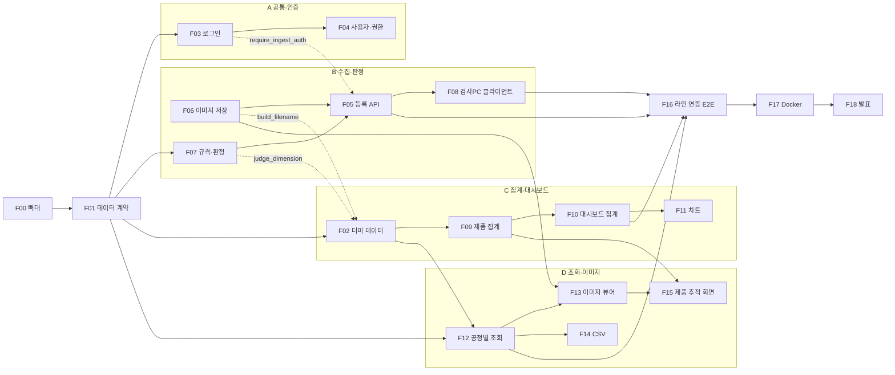

# 기능별 개발 계획

VisionQC AI MES 를 **기능 19개(F00 ~ F18)** 로 나눈 개발 단위 문서입니다.
기능 하나 = 브랜치 하나 = PR 하나 = 이슈 하나로 개발합니다.

- 기능마다 **담당, 먼저 끝나야 하는 기능, 손대는 파일, API, 완료 기준(테스트)** 이 정해져 있습니다.
- 모든 코드 파일 맨 위에 `[기능 F05 · 담당 B]` 처럼 표시돼 있어서, 파일을 열면 어느 기능인지 바로 알 수 있습니다.
- 백엔드 테스트도 기능별 파일로 나눠져 있어서, **자기 기능 테스트만 따로** 돌릴 수 있습니다.

담당 A·B·C·D 는 [TEAM.md](TEAM.md) 의 영역입니다. 이름은 팀에서 정해서 채우세요.

| 담당 | 영역 | 이름 |
|---|---|---|
| A | 공통 기반 · 인증 · 배포 (팀장) | |
| B | 검사 데이터 수집 · 판정 · 라인 연동 | |
| C | 제품 집계 · 대시보드 | |
| D | 조회 · 이미지 · 제품 추적 화면 | |

---

## 목차
1. [전체 기능 목록](#1-전체-기능-목록)
2. [의존 관계 (무엇이 먼저인가)](#2-의존-관계)
3. [일정표](#3-일정표)
4. [기능 카드 (상세)](#4-기능-카드)
5. [여러 기능이 같이 쓰는 파일 규칙](#5-여러-기능이-같이-쓰는-파일-규칙)
6. [기능 하나 개발하는 순서 (브랜치 → PR)](#6-기능-하나-개발하는-순서)
7. [AI(Claude · Codex)로 기능 개발할 때](#7-aiclaude--codex로-기능-개발할-때)
8. [테스트 파일 ↔ 기능 대응표](#8-테스트-파일--기능-대응표)

---

## 1. 전체 기능 목록

난이도: ★ 쉬움 · ★★ 보통 · ★★★ 어려움 / 기간은 1명 기준 대략적인 작업일

| ID | 기능 | 담당 | 난이도 | 기간 | 먼저 끝나야 하는 기능 | 완료 기준 테스트 |
|---|---|---|---|---|---|---|
| **0단계 · 기반** |||||||
| F00 | 개발 환경 · 프로젝트 뼈대 | A | ★ | 1~2일 | - | `/api/health` + 4명 실행 |
| F01 | 데이터 계약 (DB 테이블 · API 형식) | A (전원 리뷰) | ★★ | 2일 | F00 | 4명 리뷰 승인 |
| F02 | 더미 데이터 생성 | C | ★ | 1~2일 | F01, (F06·F07 함수 2개) | `seed.py --demo` |
| **1단계 · 기능 (병렬)** |||||||
| F03 | 로그인 · 인증 | A | ★★ | 2~3일 | F01 | `tests/test_auth.py` |
| F04 | 사용자 관리 · 내 계정 · 권한 | A | ★★ | 2일 | F03 | `tests/test_users.py` |
| F05 | 검사 결과 등록 API | B | ★★ | 2~3일 | F01, F06, F07, (F03) | `tests/test_ingest.py` |
| F06 | 이미지 저장 · 파일명 규칙 | B | ★★ | 1~2일 | F00 | `tests/test_ingest.py` |
| F07 | 치수 규격 · OK/NG 판정 | B | ★★ | 2일 | F01, F03 | `tests/test_specs.py` |
| F08 | 검사 PC 연동 클라이언트 | B | ★★★ | 3일 | F05 의 API 형식 | `vision_client/test_mes_client.py` |
| F09 | 제품 집계 로직 · 제품 API | C | ★★★ | 2~3일 | F01, F02 | `tests/test_products.py` |
| F10 | 대시보드 집계 (KPI · 공정흐름 · 품목 · 불량유형 · 최근불량) | C | ★★ | 2~3일 | F09 | `tests/test_dashboard.py` |
| F11 | 대시보드 차트 (시간대별 · 일별) | C | ★★ | 2일 | F09, F10 | `tests/test_dashboard.py` |
| F12 | 공정별 검사 조회 | D | ★★ | 2~3일 | F01, F02, F03 | `tests/test_inspections.py` |
| F13 | 이미지 뷰어 · 이미지 보안 · 삭제 | D | ★★★ | 3일 | F06, F12 | `tests/test_inspections.py` |
| F14 | CSV 내보내기 | D | ★ | 1일 | F12 | `tests/test_inspections.py` |
| F15 | 제품 추적 화면 | D | ★★ | 2일 | F09, F13 | 화면 체크리스트 |
| **2단계 · 통합** |||||||
| F16 | 실제 검사 라인 연동 (E2E) | B 주도 · 전원 | ★★★ | 3~5일 | F05~F08, F10, F12 | E2E 체크리스트 |
| F17 | Docker 배포 | A | ★★ | 1~2일 | 전체 | 새 PC 에서 `docker compose up` |
| F18 | 발표 · 데모 준비 | 전원 | ★ | 2일 | 전체 | 데모 리허설 |

담당별 합계: A 5개(F00 F01 F03 F04 F17) · B 5개(F05~F08 F16) · C 4개(F02 F09~F11) · D 4개(F12~F15)

---

## 2. 의존 관계

화살표 = "앞 기능이 있어야 뒤 기능을 끝낼 수 있음". 점선 = 일부(함수 1~2개)만 먼저 필요.



(GitHub 에서 열면 그림으로 보입니다)

**막히지 않게 하는 3가지 약속**
1. **F01(데이터 계약)을 1주차에 확정**합니다. 테이블과 API 응답 모양이 정해지면 4명이 동시에 시작할 수 있습니다.
2. **B 는 F01 직후 1~2일 안에 `build_filename()`(F06)과 `judge_dimension()`(F07)을 먼저 PR** 합니다. 둘 다 DB 없는 순수 함수라 금방 되고, C 의 더미 데이터(F02)가 이걸 씁니다.
3. **F03(로그인)이 늦어도 기다리지 않습니다.** 조회 API 는 일단 `Depends(get_current_user)` 없이 만들고, F03 이 merge 되면 한 줄 붙입니다.

---

## 3. 일정표

5주 기준 예시입니다. 실제 마감에 맞춰 늘리거나 줄이세요.

| 주차 | A | B | C | D |
|---|---|---|---|---|
| **1주** | F00 뼈대 → F01 데이터 계약 | F01 리뷰 · F06 `build_filename` · F07 `judge_dimension` 먼저 | F01 리뷰 · F02 더미 데이터 | F01 리뷰 · 화면 설계(와이어프레임) |
| **2주** | F03 로그인 | F06 완성 · F07 규격 화면 | F09 제품 집계 | F12 공정별 조회 |
| **3주** | F04 사용자·권한 | F05 등록 API · F08 클라이언트 시작 | F10 대시보드 집계 | F13 이미지 뷰어 · F14 CSV |
| **4주** | 코드 리뷰 · 버그 · F17 Docker | F08 완성 · **F16 라인 연동** (전원 지원) | F11 차트 · F16 지원 | F15 제품 추적 화면 · F16 지원 |
| **5주** | F18 발표 (전원) · 리허설 · 마지막 버그 수정 ||||

**중간 점검 (매주 금요일 30분)**: 이번 주 merge 된 기능 데모 → 다음 주 막힐 것 공유 → 일정표 갱신

---

## 4. 기능 카드

각 카드의 "파일" 은 완성본 기준 위치입니다. 처음부터 다시 만드는 경우에도 같은 위치에 만들면 됩니다.
"완료 기준" 을 모두 만족해야 PR 을 merge 합니다.

### 0단계 · 기반

#### F00 개발 환경 · 프로젝트 뼈대 — A · ★ · 1~2일
**목표** 4명 모두 같은 환경에서 빈 앱(백엔드 + 프론트)을 띄운다. 이후 다른 기능이 공통 파일을 안 건드려도 되게 **자리를 미리 다 만들어 둔다.**

| 구분 | 내용 |
|---|---|
| 백엔드 파일 | `backend/app/config.py` `database.py` `main.py`, `requirements*.txt`, `.env.example`, `tests/conftest.py` |
| 설치·실행 스크립트 | `install.bat` `start.bat` `test.bat` (+ `.sh`), `.gitattributes` — 패키지를 추가하면 목록 파일만 고치면 됨 |
| 프론트 파일 | `frontend/package.json` `vite.config.js` `index.html`, `src/main.jsx` `App.jsx` `components/Layout.jsx` `styles.css` `api/client.js` |
| 저장소 | GitHub 저장소, `.gitignore`, `main` 브랜치 보호(직접 push 금지, PR 리뷰 1명 필수) |
| API | `GET /api/health` |

구현 체크리스트
- [ ] `main.py` 에 **모든 라우터를 미리 등록** (`routers/` 아래 8개 파일을 `router = APIRouter(...)` 한 줄만 있는 빈 파일로 생성) → 이후 기능이 main.py 를 안 고침
- [ ] `App.jsx` 에 **모든 화면 주소를 미리 등록**, 각 페이지는 `<h2>준비 중</h2>` 만 있는 빈 파일 → 이후 기능이 App.jsx 를 안 고침
- [ ] `Layout.jsx` 메뉴 전부 (대시보드 / 공정별 검사 / 제품 추적 / 치수 규격 / 사용자)
- [ ] `client.js` 에 공통 `request()` 함수와 기능별 빈 구역 주석 (`// 인증 (F03·F04, A)` …)
- [ ] `styles.css` 에 색 변수(`:root`)와 공통 스타일, 기능별 구역 주석
- [ ] `vite.config.js` 의 `/api` 프록시

완료 기준
- [ ] 4명 PC 모두에서 `uvicorn app.main:app --reload` + `npm run dev` 성공
- [ ] http://localhost:8000/api/health → `{"status":"ok","db":"ok"}` (MySQL 연결 확인)
- [ ] 화면에서 메뉴를 누르면 빈 페이지로 이동

---

#### F01 데이터 계약 (DB 테이블 · API 형식) — A (전원 리뷰) · ★★ · 2일
**목표** 모든 기능이 공유하는 **테이블과 API 요청/응답 모양을 확정**한다. 이게 정해져야 4명이 동시에 개발할 수 있다.

| 구분 | 내용 |
|---|---|
| 파일 | `backend/app/models.py` (테이블 5개), `backend/app/schemas.py` (요청/응답 전부), `backend/sql/schema.sql` |
| 참고 | [ARCHITECTURE.md](ARCHITECTURE.md) 3장(데이터 설계) · 5장(API 명세) |

구현 체크리스트
- [ ] 테이블: `users` `item_specs` `inspections` `dimension_results` `defect_results`
- [ ] 치수 컬럼: `width_mm` `length_mm` `height_mm` `status` (+ `reported_status`)
- [ ] 결함 컬럼: `defect_detected` `type` `confidence` `box`
- [ ] 공정 코드: `DIM3D` `PATCHCORE` `YOLO` / 판정 `OK` `NG` / 권한 `ADMIN` `OPERATOR`
- [ ] 이미지 파일명 규칙: `yyyy-mm-dd-품목-공정-시리얼.확장자`
- [ ] 응답 형식: `InspectionOut`, `InspectionPage`, `ProductOut`, `DashboardSummary`, `TrendPoint` …

완료 기준
- [ ] 서버 시작 시 테이블 5개 자동 생성
- [ ] http://localhost:8000/docs 아래쪽 Schemas 에 모든 형식이 보임
- [ ] **B·C·D 3명 모두 PR 승인** (각자 자기 기능에 필요한 필드가 다 있는지 확인)
- [ ] 이후 `models.py` `schemas.py` 변경은 A 에게 PR 로만

---

#### F02 더미 데이터 생성 — C · ★ · 1~2일
**목표** 실제 검사 라인 없이도 C·D 가 화면을 개발할 수 있게 그럴듯한 데이터를 만든다.

| 구분 | 내용 |
|---|---|
| 파일 | `backend/seed.py` |
| 먼저 필요 | F01 (테이블), F06 `build_filename()`, F07 `judge_dimension()` — B 가 늦으면 seed.py 안에 임시로 간단히 만들고 나중에 교체 |

구현 체크리스트
- [ ] 기본 계정 `admin/admin1234`(관리자), `operator/oper1234`(작업자)
- [ ] 품목 규격 3개 (Redcar, Bluecar, Greencar)
- [ ] `--demo`: 최근 7일, 하루 40~70개 제품이 08~18시에 3공정을 지나감, 일부 NG·재검사, 오늘은 일부 진행중
- [ ] `--reset`: 테이블·이미지 전부 삭제 후 재생성
- [ ] 여러 번 실행해도 중복 생성 안 함

완료 기준
- [ ] `python seed.py --demo` 후 `inspections` 수백 행, `storage/images/날짜/` 에 이미지 파일
- [ ] 다시 실행하면 "이미 있습니다" 메시지

---

### 1단계 · A 영역

#### F03 로그인 · 인증 — A · ★★ · 2~3일
**목표** 로그인해야만 화면과 API 를 쓸 수 있게 한다.

| 구분 | 내용 |
|---|---|
| 백엔드 | `app/security.py` (`hash_password` `verify_password` `create_access_token` `get_current_user` `require_admin` `require_ingest_auth`), `app/routers/auth.py` (`login` `me`) |
| 프론트 | `src/context/AuthContext.jsx`, `src/pages/Login.jsx`, `App.jsx` 의 `RequireAuth`, `api/client.js` 의 `tokenStore`·401 처리 |
| API | `POST /api/auth/login`, `GET /api/auth/me` |

구현 체크리스트
- [ ] 비밀번호 bcrypt 해시, JWT 발급(8시간)
- [ ] `get_current_user`: 토큰 없음/틀림/만료/비활성 계정 → 401
- [ ] `require_ingest_auth`: `X-API-Key` 또는 로그인 (B 의 F05 가 사용)
- [ ] 프론트: 토큰 localStorage 저장, 새로고침해도 로그인 유지, 401 받으면 로그인 화면

완료 기준
- [ ] `pytest tests/test_auth.py -v` 통과
- [ ] 화면: 로그인 → 대시보드, 새로고침해도 유지, 로그아웃, 틀린 비밀번호 메시지

> merge 되면 팀에 알리기 → B·C·D 는 자기 API 에 `Depends(get_current_user)` 한 줄씩 붙임

---

#### F04 사용자 관리 · 내 계정 · 권한 — A · ★★ · 2일
**목표** 관리자가 계정을 관리하고, 작업자는 조회만 하게 한다.

| 구분 | 내용 |
|---|---|
| 백엔드 | `app/routers/users.py`, `app/routers/auth.py` 의 `change_password` |
| 프론트 | `src/pages/Users.jsx`, `src/pages/Account.jsx`, `Layout.jsx` 의 관리자 전용 메뉴 |
| API | `GET/POST /api/users`, `PATCH /api/users/{id}`, `PUT /api/auth/password` |

구현 체크리스트
- [ ] 사용자 추가 / 권한 변경 / 사용 중지·재사용 / 비밀번호 초기화
- [ ] 자기 자신의 관리자 권한·활성 상태는 변경 불가
- [ ] 작업자가 `/users` 주소로 들어오면 대시보드로

완료 기준
- [ ] `pytest tests/test_users.py::test_user_management -v` 통과
- [ ] `test_operator_cannot_admin` 은 여러 기능에 걸친 권한 테스트 → **F07·F13 merge 후** 통과 확인
- [ ] 화면: 새 계정 로그인, 사용 중지 계정 로그인 불가

---

### 1단계 · B 영역

#### F05 검사 결과 등록 API — B · ★★ · 2~3일
**목표** 검사 PC 가 이미지와 결과를 올리면 판정해서 저장한다. **MES 의 입구.**

| 구분 | 내용 |
|---|---|
| 백엔드 | `app/routers/ingest.py` (`create_inspection`) |
| API | `POST /api/inspections` — multipart (`image` 파일 + `payload` JSON 문자열), 헤더 `X-API-Key` |
| 먼저 필요 | F01, F06 `save_image`, F07 `judge_inspection`, F03 `require_ingest_auth` |

구현 체크리스트
- [ ] payload 검증 (JSON 아님 / 형식 틀림 → 422, 공정과 데이터 종류 불일치 → 422)
- [ ] 순서: **판정 → 이미지 저장 → DB 기록**, DB 기록 실패 시 방금 저장한 이미지 삭제
- [ ] 시간대(`+09:00`)가 붙은 검사 시각은 서버 로컬 시각으로 변환
- [ ] 로그: 누가(machine/아이디) 어떤 파일을 OK/NG 로 등록했는지

완료 기준
- [ ] `pytest tests/test_ingest.py -v` 통과
- [ ] `/docs` 또는 curl 로 업로드 → MySQL 에 행 + 날짜 폴더에 이미지 생성 ([ARCHITECTURE.md 5-2](ARCHITECTURE.md#5-2-검사-등록-검사-pc) curl 예시)

> F07 판정 전이라면 임시로 `dimension.status` 를 그대로 쓰고, F07 merge 후 교체

---

#### F06 이미지 저장 · 파일명 규칙 — B · ★★ · 1~2일
**목표** 요구사항의 저장 규칙을 구현한다.

| 구분 | 내용 |
|---|---|
| 백엔드 | `app/storage.py` **위쪽 구역** (`build_filename` `save_image` `delete_image` `resolve_image`) — 아래쪽 "서명된 주소" 구역은 D(F13) |
| 먼저 줄 것 | `build_filename()` — **1주차에 먼저 PR** (C 의 F02 가 사용) |

구현 체크리스트
- [ ] 파일명 `2026-10-05-Redcar-DIM3D-SN0001.png`, 폴더 `storage/images/2026-10-05/`
- [ ] 시리얼 안의 `-` 는 `_` 로 (구분자와 안 섞이게)
- [ ] 재검사는 `_r2` `_r3` (덮어쓰기 금지, `open(..., "xb")`)
- [ ] 확장자 `.jpg .jpeg .png .bmp`, 20MB 제한, 빈 파일 거부
- [ ] `../` 경로 조작 차단 (`resolve_image`)

완료 기준
- [ ] `pytest tests/test_ingest.py::test_retest_gets_suffix -v` 통과
- [ ] `pytest tests/test_specs.py::test_filename_rule_and_spec_judgement -v` 의 파일명 부분 통과

---

#### F07 치수 규격 · OK/NG 판정 — B · ★★ · 2일
**목표** 3D 치수를 품목별 규격(기준값 ± 공차)으로 서버가 판정한다. 판정 규칙은 이 기능 한 곳에만 둔다.

| 구분 | 내용 |
|---|---|
| 백엔드 | `app/services/judge.py` (`judge_dimension` `judge_inspection`), `app/routers/specs.py` |
| 프론트 | `src/pages/Specs.jsx` |
| API | `GET /api/specs`, `PUT/DELETE /api/specs/{item}` (수정은 관리자) |
| 먼저 줄 것 | `judge_dimension()` — **1주차에 먼저 PR** (C 의 F02 가 사용) |

구현 체크리스트
- [ ] 규격 있으면 세 축 모두 `|측정값 − 기준값| ≤ 공차` → OK, 아니면 NG
- [ ] 규격 없으면 검사 PC 가 보낸 `status` 사용, 그것도 없으면 422
- [ ] PATCHCORE/YOLO: 결함 하나라도 있으면 NG
- [ ] 화면: 관리자는 추가·수정·삭제, 작업자는 보기만

완료 기준
- [ ] `pytest tests/test_specs.py -v` 통과
- [ ] 화면: 규격 수정 후 새로 올린 검사가 새 기준으로 판정됨

---

#### F08 검사 PC 연동 클라이언트 — B · ★★★ · 3일
**목표** 팀의 AI 코드가 `import` 한 줄로 결과를 MES 에 보내게 한다. 서버가 꺼져도 결과를 잃지 않는다.

| 구분 | 내용 |
|---|---|
| 파일 | `vision_client/mes_client.py`, `vision_client/example_pipeline.py`, `vision_client/requirements.txt` |
| 먼저 필요 | F05 의 API 형식 (F01 에서 확정되므로 F05 완성 전에도 시작 가능) |

구현 체크리스트
- [ ] `MESClient.send_dimension()`, `send_defects()`
- [ ] 연결 실패·5xx → `mes_queue/` 에 저장, 다음 전송 때 오래된 것부터 재전송 (검사 시각은 처음 값)
- [ ] 4xx → `MESError` (큐에 안 쌓음), 큐 재전송 중 거부되면 `mes_queue_failed/` 로
- [ ] 변환 함수: `yolo_to_detections` (ultralytics), `patchcore_to_detections`, `anomaly_map_to_box`

완료 기준
- [ ] `cd vision_client` → `pytest -v` (가짜 서버로 돌아서 MES 서버 불필요) 통과
- [ ] 실제 MES 서버에 `python example_pipeline.py SN0001 Redcar sample.png` → 대시보드에 반영

---

### 1단계 · C 영역

#### F09 제품 집계 로직 · 제품 API — C · ★★★ · 2~3일
**목표** "검사" 단위 데이터를 "제품(시리얼)" 단위로 묶어서 양품 / 불량 / 진행중을 계산한다. 대시보드와 제품 추적의 기반.

| 구분 | 내용 |
|---|---|
| 백엔드 | `app/services/products.py` (`aggregate_products` `product_status` `count_status` `defect_rate`), `app/routers/products.py` |
| API | `GET /api/products`, `GET /api/products/{serial_no}/history` |

구현 체크리스트
- [ ] 공정별 **마지막** 검사 결과 사용 (재검사 반영), 재검사 횟수(`attempts`)
- [ ] NG 하나라도 → 불량, 3공정 모두 OK → 양품, 그 외 → 진행중
- [ ] 제품은 **첫 검사한 날** 에 집계 (자정 넘겨도 이틀에 안 잡힘)
- [ ] 불량률 = 불량 ÷ (양품 + 불량) — 진행중 제외
- [ ] 상태 필터(`status`), 페이지

완료 기준
- [ ] `pytest tests/test_products.py -v` 통과
- [ ] `/docs` 에서 더미 데이터로 호출해 상태별 개수 확인

---

#### F10 대시보드 집계 — C · ★★ · 2~3일
**목표** 메인 화면의 숫자와 표.

| 구분 | 내용 |
|---|---|
| 백엔드 | `app/routers/dashboard.py` 의 `summary` |
| 프론트 | `src/pages/Dashboard.jsx` (KPI 5개, 공정 흐름, 품목별 표, 불량 유형, 최근 불량 썸네일) |
| API | `GET /api/dashboard/summary?date=` |

구현 체크리스트
- [ ] KPI: 검사 제품 / 양품 / 불량 / 진행중 / 불량률 (제품 단위)
- [ ] 공정 흐름: 공정별 검사 건수·OK·NG (검사 단위), 누르면 공정별 조회로 이동
- [ ] 품목별 표, 불량 유형 순위 (PatchCore·YOLO 결함 type)
- [ ] 최근 불량 12건 썸네일 → 클릭 시 이미지 뷰어 (F13 전에는 썸네일만)
- [ ] 날짜 선택, 오늘이면 30초 자동 새로고침

완료 기준
- [ ] `pytest tests/test_dashboard.py -v` 통과 (summary 부분)
- [ ] 화면: 숫자가 제품 추적 화면의 개수와 일치

---

#### F11 대시보드 차트 — C · ★★ · 2일
**목표** 시간대별·일별 추이를 차트로.

| 구분 | 내용 |
|---|---|
| 백엔드 | `app/routers/dashboard.py` 의 `hourly` `daily` |
| 프론트 | `src/components/Charts.jsx` (`StackedBars` `HBars`), `Dashboard.jsx` 의 차트 영역 |
| API | `GET /api/dashboard/hourly?date=`, `GET /api/dashboard/daily?date_from=&date_to=` |

구현 체크리스트
- [ ] 시간대별: 24칸, OK 위에 NG 누적 (검사 단위)
- [ ] 일별: 기본 최근 14일, 데이터 없는 날도 0 (제품 단위)
- [ ] 범례 항상 표시, 막대에 마우스 올리면 툴팁
- [ ] (차트를 더 늘릴 거면 Recharts 도입 검토 — [PACKAGES.md](PACKAGES.md) "일부러 쓰지 않은 것")

완료 기준
- [ ] `pytest tests/test_dashboard.py -v` 통과 (hourly 24개, daily 14개)
- [ ] 화면: 툴팁 숫자가 공정별 조회 건수와 일치

---

### 1단계 · D 영역

#### F12 공정별 검사 조회 — D · ★★ · 2~3일
**목표** 공정별로 검사 목록을 찾아본다.

| 구분 | 내용 |
|---|---|
| 백엔드 | `app/routers/inspections.py` (`_filters` `list_inspections` `list_items`), `app/services/query.py` (`date_range` `apply_filters` `to_out`) |
| 프론트 | `src/pages/Inspections.jsx`, `src/components/Pager.jsx` `ResultBadge.jsx` |
| API | `GET /api/inspections`, `GET /api/items` |

구현 체크리스트
- [ ] 탭: 전체 / 3D / PatchCore / YOLO — 탭마다 컬럼 다름 (3D: W·L·H, 결함: 유형·신뢰도)
- [ ] 필터: 기간, 품목, 판정, 시리얼(부분 검색, Enter)
- [ ] 필터를 **주소창 쿼리스트링** 에 저장 (새로고침 유지, 대시보드에서 링크로 열기)
- [ ] 최신순, 페이지(20건)
- [ ] `to_out()` 의 `image_url` 은 F13 에서 서명 주소로 교체 (그 전에는 임시 경로)

완료 기준
- [ ] `pytest tests/test_inspections.py::test_list_filters_and_paging -v` 통과
- [ ] 화면: 대시보드 공정 카드 클릭 → 해당 공정·날짜로 필터된 목록

---

#### F13 이미지 뷰어 · 이미지 보안 · 삭제 — D · ★★★ · 3일
**목표** 이미지 위에 결함 박스를 정확히 그리고, 로그인한 사람만 이미지를 볼 수 있게 한다.

| 구분 | 내용 |
|---|---|
| 백엔드 | `app/storage.py` **아래쪽 구역** (`_sign` `image_url` `verify_signature`), `app/routers/images.py`, `app/routers/inspections.py` 의 `get_inspection` `delete_inspection` |
| 프론트 | `src/components/ImageViewer.jsx` (대시보드·조회·제품 이력에서 공통 사용) |
| API | `GET /api/images/{경로}?exp=&sig=`, `GET /api/inspections/{id}`, `DELETE /api/inspections/{id}` (관리자) |

구현 체크리스트
- [ ] 이미지 주소에 HMAC 서명 + 만료시각 (1시간 단위로 맞춰 브라우저 캐시 가능)
- [ ] 서명 틀림/만료 → 403, `../` → 404
- [ ] 결함 박스: 원본 이미지 크기의 SVG 를 겹쳐 그림 → 화면 크기와 무관하게 위치 정확
- [ ] 박스 on/off, ESC 닫기, 원본 보기, 치수·결함 표, 검사PC 판정 ≠ 서버 판정 표시
- [ ] 관리자 삭제 (DB 행 + 이미지 파일)

완료 기준
- [ ] `pytest tests/test_inspections.py::test_signed_image_url -v` 통과
- [ ] 화면: **실제 카메라 해상도 이미지**로 박스 위치 확인 (F16 때 재확인)

---

#### F14 CSV 내보내기 — D · ★ · 1일
| 구분 | 내용 |
|---|---|
| 백엔드 | `app/routers/inspections.py` 의 `export_inspections` |
| 프론트 | `api/client.js` 의 `download()`, `Inspections.jsx` 의 [CSV 다운로드] 버튼 |
| API | `GET /api/inspections/export` (목록과 같은 필터) |

구현 체크리스트
- [ ] 지금 보고 있는 필터 그대로, 페이지 구분 없이 전체 (최대 10만 행)
- [ ] 엑셀 한글 깨짐 방지 BOM, 조금씩 흘려보내기(StreamingResponse)

완료 기준
- [ ] `pytest tests/test_inspections.py::test_export_csv -v` 통과
- [ ] 엑셀에서 열어서 한글·숫자 정상

---

#### F15 제품 추적 화면 — D · ★★ · 2일
**목표** 제품 1개가 3공정을 어떻게 거쳤는지 한눈에.

| 구분 | 내용 |
|---|---|
| 프론트 | `src/pages/Products.jsx`, `src/pages/ProductHistory.jsx` |
| 사용 API | F09 의 `GET /api/products`, `GET /api/products/{serial}/history` |

구현 체크리스트
- [ ] 목록: 시리얼 · 품목 · 3공정 결과 칸 · 재검사 횟수 · 최종 상태, 필터(기간·품목·상태·시리얼)
- [ ] 이력: 공정 순서대로 이미지 카드, 치수/결함 요약, 클릭 → 이미지 뷰어(F13)
- [ ] 다른 화면의 시리얼 링크가 모두 이력 화면으로 연결

완료 기준 (화면 체크리스트)
- [ ] 상태 필터 "불량" → 목록 개수가 대시보드 불량 KPI 와 일치
- [ ] 재검사 제품에 "재검 1" 표시, 이력에 카드 2장
- [ ] 진행중 제품은 남은 공정 칸이 `-`

---

### 2단계 · 통합

#### F16 실제 검사 라인 연동 (E2E) — B 주도 · 전원 · ★★★ · 3~5일
**목표** 이미 완성된 3D 치수 · PatchCore · YOLO 코드에 `mes_client` 를 붙여서, 실제 제품이 MES 화면까지 흘러가게 한다.

체크리스트
- [ ] **시리얼 부여 방식 통일**: 같은 제품은 3공정 모두 같은 `serial_no` (바코드/카운터/타임스탬프 중 결정)
- [ ] 품목 이름 통일 (영문, 예: `Redcar`)
- [ ] 3D 코드 → `send_dimension()`, PatchCore → `patchcore_to_detections()` + `anomaly_map_to_box()`, YOLO → `yolo_to_detections()`
- [ ] PatchCore 점수 범위가 0~1 이 아니면 정규화 방법 결정
- [ ] YOLO 클래스 이름이 결함 유형으로 그대로 보이는지 확인 (`scratch` 등)
- [ ] 실제 해상도 이미지에서 결함 박스 위치 확인 (D)
- [ ] 품목별 실제 규격 등록 (B)
- [ ] 검사 PC ↔ 서버 네트워크 ([SETUP.md 8장](SETUP.md#8-다른-pc-에서-접속하기)), 서버를 껐다 켜서 큐 재전송 확인
- [ ] 하루 분량 운영해 보고 대시보드 숫자 검증 (C)

완료 기준
- [ ] 제품 10개 이상을 실제로 흘려서 대시보드 · 공정별 조회 · 제품 추적에 정확히 표시

---

#### F17 Docker 배포 — A · ★★ · 1~2일
| 구분 | 내용 |
|---|---|
| 파일 | `docker-compose.yml`, `backend/Dockerfile`, `frontend/Dockerfile`, `frontend/nginx.conf`, `.dockerignore` |

완료 기준
- [ ] 아무것도 안 깔린 PC(Docker 만)에서 `docker compose up -d --build` → http://localhost 로그인
- [ ] `docker compose down` 후 다시 켜도 데이터·이미지 유지
- [ ] 비밀번호/키를 기본값에서 변경

---

#### F18 발표 · 데모 준비 — 전원 · ★ · 2일
- [ ] 데모 시나리오: 제품 1개가 3공정 → YOLO 에서 불량 → 대시보드에 바로 뜸 → 제품 추적에서 공정별 이미지 확인 → CSV 다운로드
- [ ] 각자 자기 기능 1~2분 설명 (기능 카드의 "목표"와 "구현 체크리스트" 기준)
- [ ] README 에 화면 캡처
- [ ] 리허설 2회 (네트워크 끊김 대비: 더미 데이터 백업 시연 준비)

---

## 5. 여러 기능이 같이 쓰는 파일 규칙

같은 파일을 두 명이 동시에 고치면 Git 충돌이 납니다. 아래 파일만 조심하면 나머지는 기능별로 파일이 나뉘어 있습니다.

| 파일 | 관련 기능 | 규칙 |
|---|---|---|
| `backend/app/models.py` · `schemas.py` | 전부 | **A 만 수정.** 필드가 필요하면 A 에게 요청하거나 그 부분만 작은 PR |
| `backend/app/main.py` | 전부 | F00 에서 모든 라우터를 미리 등록 → **이후 수정 없음** |
| `frontend/src/App.jsx` · `components/Layout.jsx` | 전부 | F00 에서 모든 주소·메뉴를 미리 등록 → **이후 수정 없음** |
| `frontend/src/api/client.js` | 전부 | `api = { ... }` 안의 **자기 기능 구역 주석 아래에만** 추가 |
| `frontend/src/styles.css` | 전부 | 자기 화면 스타일은 해당 구역 주석 아래에 추가. 색은 `:root` 변수만 사용 |
| `backend/app/storage.py` | F06(B) · F13(D) | 위쪽 "저장 · 파일명" 구역은 B, 아래쪽 "서명된 이미지 주소" 구역은 D |
| `backend/app/routers/dashboard.py` · `pages/Dashboard.jsx` | F10 · F11 | 둘 다 C 라서 문제 없음 |
| `backend/app/routers/inspections.py` | F12 · F13 · F14 | 셋 다 D. 검사 **등록**(POST)은 `routers/ingest.py` 로 분리돼 있어 B 와 안 겹침 |
| `backend/tests/conftest.py` | 전부 | A 만 수정. 공용 payload 도우미는 `tests/helpers.py` |

충돌이 나면: 혼자 해결하지 말고 그 파일 담당에게 같이 보자고 하기.

---

## 6. 기능 하나 개발하는 순서

```
① 이슈 만들기         GitHub Issues → "기능 개발" 템플릿 → 제목 [F05] 검사 결과 등록 API
② 브랜치 만들기       git checkout main && git pull
                      git checkout -b feature/F05-ingest
③ 개발                기능 카드의 체크리스트대로. 커밋 메시지 앞에 기능 번호
                      git commit -m "F05: payload 검증과 422 응답"
④ 자기 테스트          cd backend && pytest tests/test_ingest.py -v
⑤ 전체 테스트          pytest -q   (다른 기능을 깨지 않았는지)
⑥ PR                  git push -u origin feature/F05-ingest → GitHub 에서 PR (템플릿 자동)
                      제목 [F05] 검사 결과 등록 API, 본문에 "Closes #이슈번호"
⑦ 리뷰 1명 승인 → merge → 팀 채팅에 "F05 merge 됨" 공유
```

브랜치 이름: `feature/F번호-짧은영문` (예 `feature/F12-inspection-list`), 버그는 `fix/F번호-내용`

---

## 7. AI(Claude · Codex)로 기능 개발할 때

기능 카드가 그대로 작업 지시서가 되도록 만들었습니다.

1. **Claude 에게 줄 것**
   - 이 문서의 해당 **기능 카드 전체** (복사)
   - `backend/app/models.py`, `backend/app/schemas.py` (데이터 계약)
   - 카드의 "파일" 에 적힌 파일 중 이미 있는 것 + "먼저 필요" 기능의 파일
   - 해당 테스트 파일 (`tests/test_xxx.py`)
2. **요청 예시**
   ```
   VisionQC AI MES 프로젝트의 F12 기능을 구현해줘.
   아래 기능 카드의 구현 체크리스트를 모두 만족해야 하고,
   tests/test_inspections.py::test_list_filters_and_paging 이 통과해야 해.
   models.py / schemas.py 는 수정하지 말고, 카드에 적힌 파일만 고쳐줘.
   (기능 카드 붙여넣기)
   (관련 파일 붙여넣기)
   ```
3. **검증 (Codex 등)**
   - 카드의 "완료 기준" 테스트 실행 결과를 확인
   - "카드에 없는 파일을 고치지 않았는지", "models/schemas 를 바꾸지 않았는지" 리뷰
4. AI 가 만든 코드라도 **PR 리뷰는 사람이** 합니다. 리뷰어는 체크리스트를 하나씩 확인.

---

## 8. 테스트 파일 ↔ 기능 대응표

| 테스트 파일 | 기능 | 담당 | 테스트 |
|---|---|---|---|
| `backend/tests/test_auth.py` | F03 | A | `test_login_fail` `test_protected_without_token` |
| `backend/tests/test_users.py` | F04 (+ 권한 통합) | A | `test_user_management` `test_operator_cannot_admin` |
| `backend/tests/test_ingest.py` | F05 · F06 | B | `test_ingest_wrong_key` `test_defect_judgement_and_validation` `test_timezone_aware_time_is_stored_local` `test_retest_gets_suffix` |
| `backend/tests/test_specs.py` | F07 (+ F06 파일명) | B | `test_filename_rule_and_spec_judgement` `test_no_spec_requires_status` |
| `vision_client/test_mes_client.py` | F08 | B | 6개: 큐 재전송 · 검사 시각 유지 · 거부 처리 · 변환 함수 |
| `backend/tests/test_products.py` | F09 | C | `test_product_status` `test_retest_uses_last_result` |
| `backend/tests/test_dashboard.py` | F10 · F11 | C | `test_dashboard` |
| `backend/tests/test_inspections.py` | F12 · F13 · F14 | D | `test_list_filters_and_paging` `test_signed_image_url` `test_export_csv` |
| `backend/tests/helpers.py` | 공용 | A | `dim()` `defect()` payload 도우미 |

```bat
cd backend
pytest tests/test_ingest.py -v                                  :: 파일 하나
pytest tests/test_ingest.py::test_retest_gets_suffix -v         :: 테스트 하나
pytest -q                                                       :: 전체 (PR 전에 꼭)

cd ..\vision_client
pytest -v                                                       :: F08
```

새 기능을 추가하면 `tests/test_기능이름.py` 를 새로 만들고 이 표에 한 줄 추가하세요.
